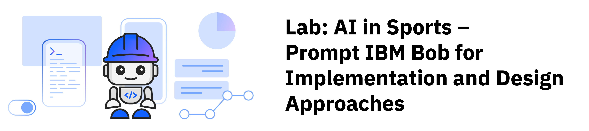
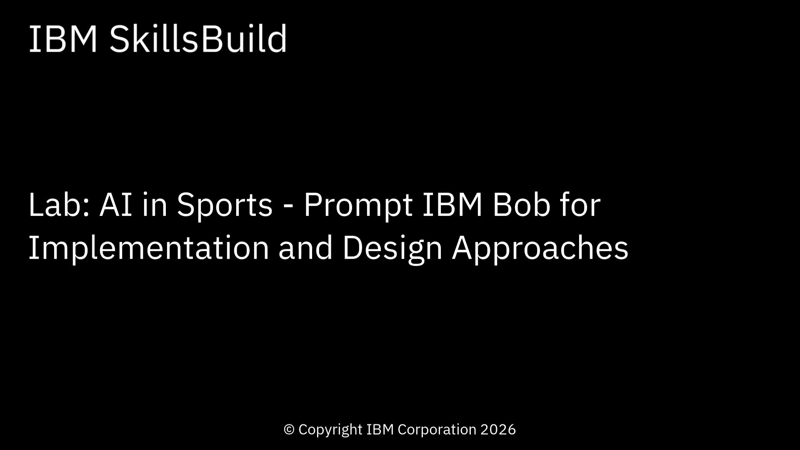
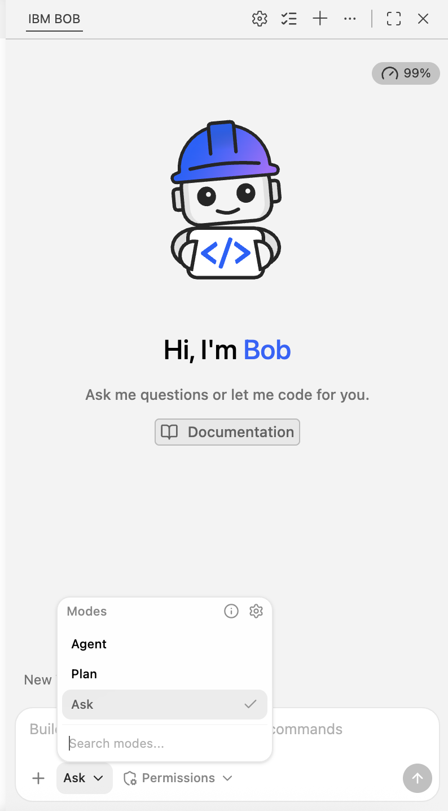
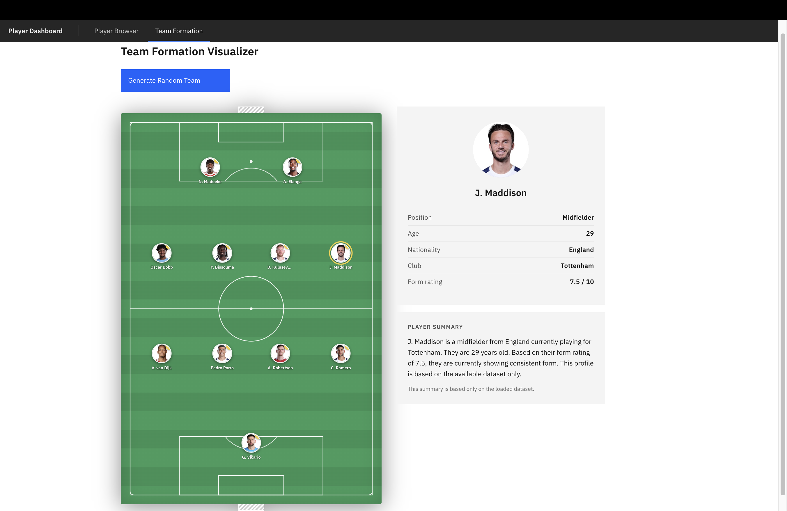
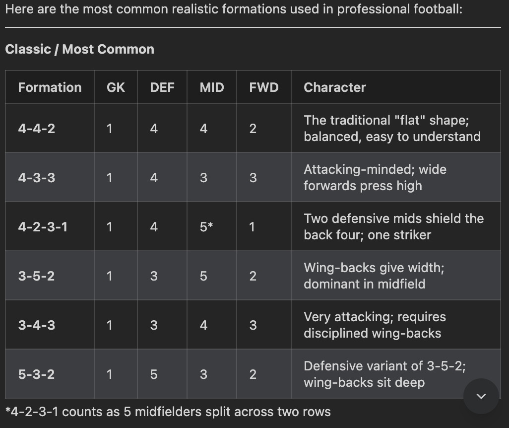
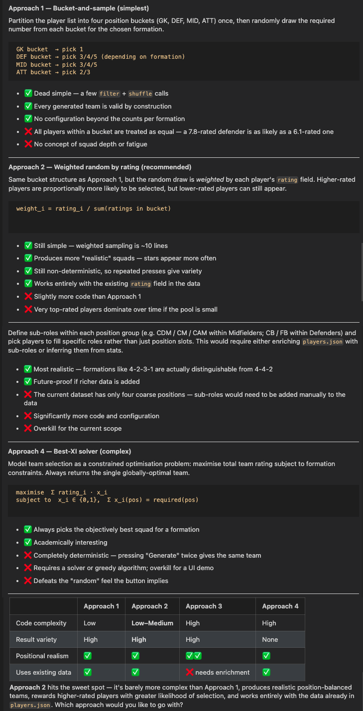
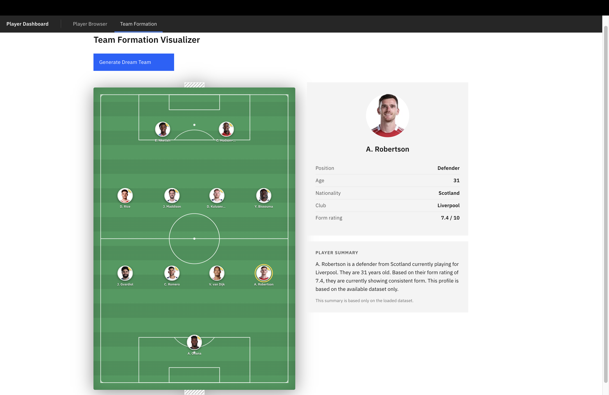
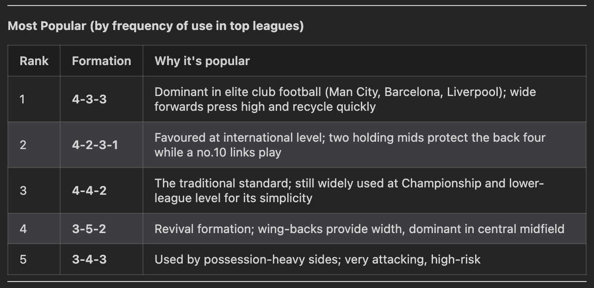
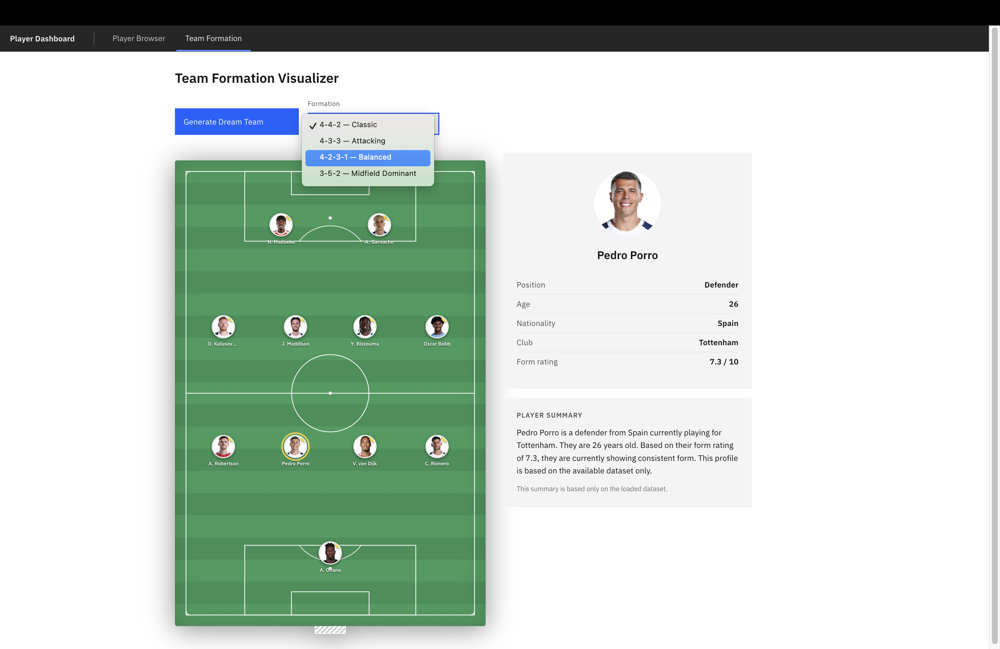
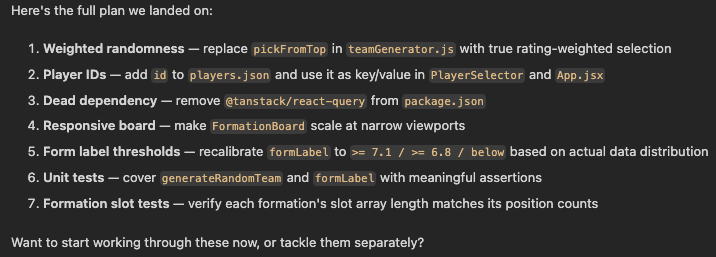

## Overview

Stop guessing, start evaluating. Learn how to prompt IBM Bob to analyze design options, weigh trade-offs, and recommend implementation approaches like an experienced software architect.

In this lab, you'll use IBM Bob to add to an existing web application that displays player information in an easy-to-understand format. You'll work with player data and guide IBM Bob using simple instructions to build different parts of your application, organize the data, and create helpful summaries.

The goal of this lab is to show you how AI can help you build applications, even if you're not an expert programmer. You'll learn how to give clear instructions to IBM Bob, set boundaries for what you want, and use real player data to get accurate results. By the end of the lab, you'll have a working application where users can explore player information, see interesting insights, and view team formations.


***

## Learning objectives

After completing this lab, you should be able to:

- Use IBM Bob to create and improve parts of your application using simple instructions.
- Write clear prompts to get the results you want.
- Add to an existing interactive application that displays player data in a user-friendly way.
- Practice prompting to elicit the quality responses.

***

## About this lab

In this lab, you add features to a player dashboard from the [Build a Football Player Dashboard with IBM Bob](../football/ai-in-sports-football-player-dashboard.md); an interactive web application that shows how AI can help you explore and analyze player data. The lab instructions show you how to use IBM Bob to add the following features to the player dashboard:

- Click a player to see their details: When you click on a player icon in the football formation board, display their full information (stats, position, rating) in a panel beside the board.

- Build realistic team formations: Make the team generator smarter by selecting players based on their actual positions—like 2 forwards, 4 midfielders, 4 defenders, and 1 goalkeeper for a proper team lineup.

- Switch between different formations: Add a dropdown to choose different team formations (like 4-4-2, 4-3-3, or 3-5-2) and see players arranged differently on the field.

***

## Estimated time

**60 minutes**

<a name="top"></a>

***

## Dataset

This lab uses real player data from the **API-Football** service. You have two options to get the data:

- **Option A:** Fetch fresh data from the API using a simple script (recommended if you want the latest information)
- **Option B:** Use the pre-prepared backup file that's already included in the project at `src/data/players.json`


| Field | Description | Example |
|---|---|---|
| `name` | Full name of the player | "M. Akanji" |
| `photo` | Player photo URL | "https://media.api-sports.io/football/players/5.png" |
| `position` | Playing position | "Defender" |
| `age` | Player's current age | 30 |
| `citizenship` | Player's nationality | "Switzerland" |
| `height` | Height in centimeters | 188 |
| `club` | Player's current club | "Manchester City" |
| `form` | Recent performance rating (0–10) | 7.27931 |


<a name="top"></a>

***

## Prerequisites

**Tip:** Right-click the following link, and open the page in a new tab.

Complete the prerequisite tasks of [Get started with IBM Bob](../../ai-in-sports/get-started-with-ibm-bob.md)

***

## Contents

- [Task 1: Set up the environment](#task01)
- [Task 2: Set up the project](#task02)
- [Task 3: Explore the codebase](#task03)
- [Task 4: Explore the starting application](#task04)
- [Task 5: Click a player to see their details](#task05)
- [Task 6: Build realistic team formations](#task06)
- [Task 7: Switch between different formations](#task07)
- [Summary](#summary)
- [More resources](#additional-resources)

***

# Preview the tutorial

Watch the following video to see a preview of the steps in this tutorial.

**Note:** Some user interface elements in the video might look different from your IBM Bob environment.

**Tip:** Right-click the following thumbnail image, and open the video in a new tab.

<a href="https://video.ibm.com/embed/channel/23669513/video/football-advanced"></a>

***

## Task 1: Set up your environment

In this task, you clone the starter project, install dependencies, and confirm that the development server runs correctly.

### Task 1a: Activate Bob's Agent mode

IBM Bob has different modes for different tasks. For this lab, you'll use **Agent** mode, which helps you write and modify code.

1. Look for the Bob chat side panel.
2. Select **Agent** mode.

   

You're now ready to start building with Bob!

### Task 1b: Install prerequisites with Bob's help

Before you can build the application, you need a few tools installed on your computer:
- **Node.js** - A program that lets you run JavaScript code on your computer (not just in a web browser)
- **Yarn** - A tool that helps download and manage the code libraries your application needs
- **Git** - A tool for downloading code from the internet and tracking changes to your files

Don't worry if you don't have these installed yet - IBM Bob will help you check and install them!

2. In Bob's chat panel, copy and paste the following prompt:

   ```text
   I need to set up a development environment for a React project. 
   Can you help me verify I have Node.js 18+, Yarn, and Git installed?

   If installed, notify me with the versions.
   If not installed, guide me through installation:
   1. First check if I'm using Mac or Windows.
   2. Detect which shell(s) I'm using (bash, zsh, etc.) and test commands in each to find where tools are available.
   3. Use the appropriate shell for all subsequent commands.
   4. Run the appropriate installation commands.
   5. Explain each command briefly before running it.
   6. Ask for my confirmation before executing each command.

   Note: On macOS, if tools like Homebrew are installed but not found in the default shell, try using interactive shell mode (e.g., `zsh -i -c 'command'`) to load the full environment profile.
   ```

   

3. Follow Bob's guidance to verify or install the required tools.

[Back to the top](#top)

***

<a name="task02"></a>

## Task 2: Set up the project

The `football-player-dashboard` starter project is based on the [template-carbon-react](https://github.com/IBM/template-carbon-react) pre-built starter project, and modified to create a professional-looking football player dashboard  application. It includes IBM's Carbon Design System, which provides ready-to-use buttons, menus, forms, and other visual elements that look polished and work well together.

Follow these steps to download and open the starter project, and then obtain your API key to access the dataset.

### Task 2a: Download and open the starter project

Follow these steps to download and open the starter project:

1. Choose a folder location for the lab work.
1. Download the [football-player-dashboard.zip](football-player-dashboard.zip) from the IBM SkillsBuild GitHub repository to the folder you chose in step 1. **Tip:** Right-click the link to open it in a new tab.
1. In IBM Bob, verify whether the terminal panel is visible. If you don't see a terminal panel, click **Terminal > New Terminal**.
1. Use the `cd` command in the terminal panel to move into that folder.
1. Execute the following command to unzip the application files.
   
   ```
   unzip football-player-dashboard.zip
   ```

1. Open the `football-player-dashboard` folder:
   1. Click **File > Open Folder**.
   1. Navigate to the `football-player-dashboard` folder.
   1. Click **Open**.

3. Review the project structure.

1. Verify that you are in *Ask* mode.

1. Copy and paste the following prompt to Bob and review the response:
    ```
    Hey Bob, What's my current working directory?
    ```
1. Verify that the working folder is correct.

#### Step 2b: Obtain your Football API key

An API key is like a password that lets your application access the player data from API-Football. Follow these steps to create an account and obtain an API key:

**Tip:** Right-click the following link, and open the page in a new tab.

1. Visit [API-Football](https://www.api-football.com/) and create a free account.
2. After signing in, clik the **Account** icon .
3. Click **My Access**.
4. At the top of the page, next to *API key*, hover over the blurred API key.
5. Copy this API key.
1. In Bob, edit the `.env` file, replace `your_api_key_here` with the actual API key you copied from API-Football in Step 2a, and save the file.


[Back to the top](#top)

***

<a name="task03"></a>

## Task 3: Explore the codebase

Follow these steps to use Bob's Ask mode to explore the existing code base:

1. In *Ask* mode, copy and paste the following prompt:

    ```
    Explore the codebase for this application.
    What does the app do? What features have already been implemented in the application? 
    What can be done next?
    Please point out any areas that need particular attention?
    ```

1. To confirm permission to read the files, click **Approve once** when prompted by Bob.

1. Review the results.

1. Switch to *Agent* mode, and then prompt Bob to:

   ```
   Fix any critical issues discovered during the exploration of the codebase
   ```

<a name="task04"></a>

## Task 4: Explore the starting application

Follow these steps to explore the initial web application:

1. Copy and paste these commands in Bob's terminal:

   ```bash
   yarn install
   yarn start:dev
   ```

   - `yarn install` downloads all the code libraries your application needs (this may take a minute)
   - `yarn start:dev` starts your application so you can view it in a web browser

2. Open a browser, and navigate to the following URL:

   ```txt
      http://localhost:3000
   ```

1. Test the application by selecting several different players to see their statistics, and then create several team formations.

1. Return to Bob, and click **New task**.

1. Copy and paste the following prompt:

   ```
   I'm going to implement three new features: 

   1. Click a player to see their details: When you click on a player icon in the football formation board, display their full information (stats, position, rating) in a panel beside the board.

   2. Build realistic team formations: Make the team generator smarter by selecting players based on their actual positions—like 2 forwards, 4 midfielders, 4 defenders, and 1 goalkeeper for a proper team lineup.

   3. Switch between different formations: Add a dropdown to choose different team formations (like 4-4-2, 4-3-3, or 3-5-2) and see players arranged differently on the field.

   I will prompt you to implement each of the new features. Please create a ToDo list for the implementation of these new features.  
   ```

[Back to the top](#top)

***

<a name="task05"></a>

## Task 5: Click a player to see their details

The first feature is fairly straight-forward, so follow these steps to prompt Bob to implement the feature:

1. Copy and paste the following prompt:

   ```
   For feature 1 (the clickable player statistics), add a side panel that displays player statistics when the user clicks a player on the formation board. 
   Provide a summary of what you did, and update the ToDo list.
   ```

1. Review the results and updated ToDo list.

**Test the application**

1. Refresh your browser if the application doesn't restart automatically.
1. In the header, click **Team Formation**.
1. On the *Team Formation* page, click the **Generate Random Team** button. Basic football field displays with 11 player photos arranged in formation.
1. Select different players to see their statistics.

The following image shows the application with feature 1 implemented:



[Back to the top](#top)

***

<a name="task06"></a>

## Task 6: Build realistic team formations

Bob can accomplish building realistic team formations using multiple approaches. Follow these steps to prompt Bob for recommendations before implementing the feature:

1. Copy and paste the following prompt:

   ```
   What would be realistic team formations for a football match?
   ```

   Review Bob's response which might look similar to the following image:

   

2. Copy and paste the following prompt:

   ```
   How would you make the team generator smarter by selecting players based on their actual positions instead of selecting players randomly?
   Please provide multiple approaches, explain each approach, and let me select the best approach.
   ```

   Review Bob's suggested approaches, and select an approach. This list might look similar to the following image:

   

4. Copy and paste the following prompt:

   ```
   For feature 2, implement the recommended approach with a twist: 
   - Randomly select from the top 3-5 ranked players in each position.
   - Also change the Generate Random Team to Generate Dream Team on the formation board.
   - Provide a summary of what you did, and update the ToDo list.

   ```

1. Review the results and updated ToDo list.

1. Test the application:
   1. On the *Team Formation* page, click the **Generate Dream Team** button. Basic football field displays with 11 player photos arranged in formation.
   1. Select different players to see their statistics.

The following image shows the application with feature 2 implemented:



[Back to the top](#top)

***

<a name="task07"></a>

## Task 7: Switch between different formations

Follow these steps to add a dropdown list for the user to select a formation before generating their dream team: 

1. Copy and paste the following prompt:

   ```
   What are the most popular and most competitive formations for a football team?
   ```

   Review Bob's response which might look similar to the following image:

   

1. Copy and paste the following prompt:

   ```
   For feature 3, create a formation selector as a dropdown list that allows the user to choose from four different team formations based on the most popular formations.
   When the user selects a formation, the players are repositioned based on the selected tactical setup.
   Provide a summary of what you did, and update the ToDo list.

   ```

1. Review the results and updated ToDo list.

1. Test the application:
   1. On the *Team Formation* page, select a formation from the dropdown list.
   1. Click the **Generate Dream Team** button.
   1. Select different players to see their statistics.
   
1. Optional: Prompt Bob to modify any of the features or the visual appearance of the application.

The following image shows the application with feature 3 implemented:



[Back to the top](#top)

## Task 6: Revisit the project plan

Follow these steps to use the grill_me skill to revisit the project plan to make sure that it meets your needs:

1. Click **New task**.

1. Copy and paste the following prompt:

    ```
    I'd like you to grill me about this application.
    ```

1. Click **Approve once** when prompted by Bob to confirm permission to read, edit, and create files, and approve the proposed ToDo list.

1. Read and respond to the questions from Bob to revisit the project plan to make sure that meets your needs. Bob might find anomalies or recommend modifications, and prompt you to choose from options.

1. Review the results of the grilling session.

The following image shows an example of the results of the grilling session.



[Back to the top](#top)

***

<a name="summary"></a>

## Summary

In this lab, you used IBM Bob to add to an existing web application that displays player information in an easy-to-understand format. You worked with player data and guided IBM Bob using simple instructions to build different parts of your application, organize the data, and create helpful summaries.

### What you learned

After completing this lab, you know how to:

- Use IBM Bob to create and improve parts of your application using simple instructions.
- Write clear prompts to get the results you want.
- Add to an existing interactive application that displays player data in a user-friendly way.
- Practice prompting to elicit the quality responses.

***

<a name="additional-resources"></a>

## Additional resources

- [IBM Bob documentation](https://bob.ibm.com/docs)
- [API-Football documentation](https://www.api-football.com/documentation-v3)
