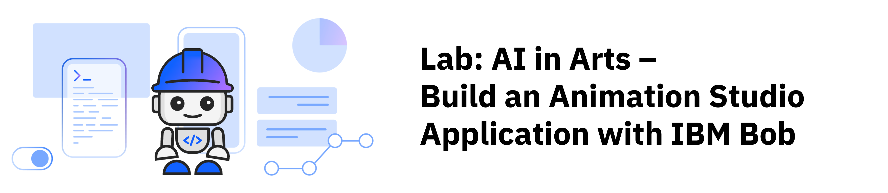
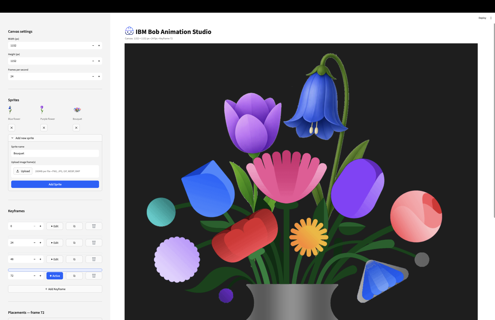

## Overview

Bring your ideas to life by building your own sprite animation studio! Learn how to use Generative AI with Python and Streamlit to create a tool that transforms static images into animated GIFs. Along the way, you'll collaborate with IBM Bob to build a real-world application step by step, gaining hands-on experience with AI-assisted coding, interactive app development, and animation design that you can showcase in your portfolio.

In this lab, you will build an application that allows the user to upload images as sprites, position them on a canvas across keyframes, apply per-frame scene effects, and export the result as a `.gif`.



***

## Learning objectives

After completing this lab, you should be able to:

- Use IBM Bob to create an animation studio application using simple instructions.
- Write clear prompts to get the results you want.
- Practice prompting to elicit the quality responses.

***

## About this lab

In this lab, you build an interactive web application that allows users to upload static images, add keyframes, and produce an animated `.gif` image.

The application includes the following features:

- A canvas for the uploaded images
- A side panel with width, height, and frames per second
- A keyframe editor
- Multi-sprite handling
- Scene effects
- Animation rendering & export

Throughout the lab, you'll guide IBM Bob with clear instructions and specific requirements. IBM Bob will help you build the application using modern web technologies without any prerequisite knowledge of coding. IBM Bob handles the technical details. You'll focus on what you want the application to do, and IBM Bob will create it for you.

***

## Estimated time

**75-90 minutes**

***

## Prerequisites

**Tip:** Right-click the following link, and open the page in a new tab.

Complete the prerequisite tasks of [Get started with IBM Bob](get-started-with-ibm-bob.md)

***

<a name="top"></a>

## Contents

- [Task 1: Set up your environment](#task01)
- [Task 2: Create the starter applicaton](#task02)
- [Task 3: Add a canvas & sprite upload](#task03)
- [Task 4: Add a keyframe and placement editor](#task04)
- [Task 5: Handle multi-frame sprites](#task05)
- [Task 6: Add scene effects](#task06)
- [Task 7: Add looping option](#task07)
- [Task 8: Add buttons for animation rendering & export](#task08)
- [Summary](#summary)
- [Additional resources](#additional-resources)

***

<a name="task01"></a>

## Task 1: Set up the environment

Before you can build the application, you need a following tools installed on your computer:

- **Python** - A versatile, high-level, general-purpose programming language known for its clean syntax and extensive ecosystem; widely used in data science, web development, automation, and AI/ML.

- **Streamlit** - An open-source Python framework for rapidly building and sharing interactive data apps and dashboards — no front-end experience required; turns Python scripts into web UIs with minimal code.

- **Pillow** - A friendly fork of the Python Imaging Library (PIL) that adds image processing capabilities to Python; supports opening, manipulating, and saving a wide range of image formats (JPEG, PNG, GIF, etc.).

- **opencv-python** - Python bindings for OpenCV (Open Source Computer Vision Library), a powerful library for real-time computer vision tasks such as image/video processing, object detection, face recognition, and more.

- **numpy** - The foundational numerical computing library for Python; provides support for large multi-dimensional arrays and matrices, along with a rich collection of mathematical functions to operate on them efficiently.

Don't worry if you don't have these installed yet - IBM Bob will help you check and install them!

Follow these steps to set up the environment:

1. Create a folder for your project with the following name:

   ```
   animation-studio
   ```
1. Copy the images that you want to animate into the `animation-studio` folder.

1. In the Bob chat side panel, select **Agent** mode.

   

1. In IBM Bob, click **File > Open Folder**, select the `animation-studio` folder, and click **Open**.

1. Copy and paste the following prompt to ask Bob to install and verify the prerequisite environment:

   ```text
   I need to set up a development environment for a project. 
   Can you help me verify I have python, streamlit, pillow, opencv-python, and numpy installed?

   If installed, notify me with the versions.
   If not installed, guide me through installation:
   1. First check if I'm using Mac or Windows.
   2. Detect which shell(s) I'm using (bash, zsh, etc.) and test commands in each to find where tools are available.
   3. Use the appropriate shell for all subsequent commands.
   4. Run the appropriate installation commands.
   5. Explain each command briefly before running it.
   6. Ask for my confirmation before executing each command.

   Note: On macOS, if tools like Homebrew are installed but not found in the default shell, try using interactive shell mode (e.g., `zsh -i -c 'command'`) to load the full environment profile.
   ```
1. To confirm permission to complete the tasks, click **Approve once** when prompted by Bob, and follow the prompts.

[Back to the top](#top)

***

<a name="task02"></a>

## Task 2: Create the starter applicaton

Follow these steps to create a Streamlit application:

1. Decide on the following elements of your application:
   - An application title
   - Background and primary colors
   - Page icon

1. Edit the following prompt with your choices, and then paste it into Bob's chat panel.

   ```
   Create a new Streamlit Python web app with the following customizations:

   - App title: IBM Bob Animation Studio
   - Main Background color: Light grey
   - Primary color: Blue
   - Page icon (an emoji that fits the theme): https://bob.ibm.com/icon.svg

   Add the page icon aligned to the bottom of the text before the "App title".

   Tell me how to run the application.
   ```

1. To confirm permission to complete the tasks, click **Approve once** when prompted by Bob, and follow the prompts.

1. Open a browser, and navigate to the provided URL.

[Back to the top](#top)

***

<a name="task03"></a>

## Task 3: Add a canvas & sprite upload

The application needs the ability for teh animator to upload images as a sprite, and a canvas where the animator can place the images to animate. Follow these steps to add a canvas and a sprite upload:

1. Copy and paste the prompt into Bob's chat panel.

   ```
   Add a sidebar to the app with a section for canvas settings — width, height, and frames per second — using sensible defaults. 
   Store these settings so they persist as the user interacts with the app. 
   In the main area, show the canvas preview full-width but not too tall to not fit on my screen /window.

   Below that, add a section in the sidebar where the user can name a sprite and upload one or more image files for it.
   When they click "Add Sprite", save the sprite to memory and automatically clear the file uploader so it is empty and ready for the next upload.
   In the main area, show all uploaded sprites as small thumbnail previews with a button to remove each one.
   ```

1. To confirm permission to complete the tasks, click **Approve once** when prompted by Bob, and follow the prompts.

1. Refresh the browser, and test the new feature.

[Back to the top](#top)

***

<a name="task04"></a>

## Task 4: Add a keyframe and placement editor

The application needs a section where the animator can add keyframes and adjust the placement for the animation. Follow these steps to add a keyferame editor:

1. Copy and paste the prompt into Bob's chat panel.

   ```
   Add a "Keyframes" section to the sidebar. The app should start with keyframe 0 already created.
   Include an "Add Keyframe" button that appends a new keyframe after the last existing one. 
   Each keyframe in the list should show an editable frame number field (so the user can change it after creation), 
   a button to copy that keyframe (duplicating all its sprite placements to a new keyframe at frame+1), and a button to remove it.
   Let the user click a keyframe to select it as the one they are editing — the selected keyframe should be visually highlighted so it is obvious which one is active. 
   Keep the list sorted by frame number at all times. Store all keyframe data in memory.

   In the main area, keep the canvas preview full-width. Everything else — sprite thumbnails, the placement editor for the active keyframe, 
   and the scene effects panel (to be added soon) — goes in the sidebar below the keyframe list, 
   so the sidebar scrolls independently and the canvas preview never moves.

   In the placement editor, each placed sprite should display as a collapsible item. When collapsed, only the placement's name is visible. 
   When expanded, show editable fields for X position, Y position, rotation, crop, scale, layer order (higher numbers display on top), and a remove button. 
   The name field should also be editable inside the expanded view. When adding a new placement, 
   show a name field above the sprite picker — if left blank, default the name to the sprite's name. 
   Draw sprites in layer order when compositing so that higher-layer sprites display on top.
   ```

1. To confirm permission to complete the tasks, click **Approve once** when prompted by Bob, and follow the prompts.

1. Refresh the browser, and test the new feature.

[Back to the top](#top)

***

<a name="task05"></a>

## Task 5: Handle multi-frame sprites

The application needs the ability to handle multiple phases of the animation. Follow these steps to handle multi-frame sprites:

1. Copy and paste the prompt into Bob's chat panel.

   ```
   Update the sprite upload so that when a user uploads multiple image files under one sprite name, all of those images are stored as an ordered sequence. 
   When rendering a frame, cycle through the sprite's images automatically based on the frame number so that multi-image sprites animate (like a walk cycle) while single-image sprites stay still.
   ```

1. To confirm permission to complete the tasks, click **Approve once** when prompted by Bob, and follow the prompts.

1. Refresh the browser, and test the new feature.

[Back to the top](#top)

***

<a name="task06"></a>

## Task 6: Add scene effects

The application can benefit from some preset scene effects, such as, blur and brightness. Follow these steps to add scene effects:

1. Copy and paste the prompt into Bob's chat panel.

   ```
   Add a scene effects panel below the placement editor for the currently selected keyframe. 
   Include controls for blur, brightness, contrast, grayscale, and sepia. 
   Store the effect settings per keyframe in memory and apply them to the canvas preview at render time.
   ```

1. To confirm permission to complete the tasks, click **Approve once** when prompted by Bob, and follow the prompts.

1. Refresh the browser, and test the new feature.

[Back to the top](#top)

***

<a name="task07"></a>

## Task 7: Add looping option

By default, the animation will loop continuosly, but the animator may want to have the animation stop after playing once. Follow these steps to add a looping option:

1. Copy and paste the prompt into Bob's chat panel.

   ```
   Add a checkbox to enable and disable looping of the animation. 
   The default should be no looping, meaning the animation plays once and then stops. 
   If toggled on, the animation should loop continuously.
   ```

1. To confirm permission to complete the tasks, click **Approve once** when prompted by Bob, and follow the prompts.

1. Refresh the browser, and test the new feature.

[Back to the top](#top)

***

<a name="task08"></a>

## Task 8: Add buttons for animation rendering & export

Once the animator has selected all of the options, the application needs a button to render the animation and then export the animation to a GIF file. Follow these steps to add buttons for these two features:

1. Copy and paste the prompt into Bob's chat panel.

   ```
   Add an export section below the canvas. 
   When the user has at least 2 keyframes, show a "Render Animation" button. 
   When clicked, generate every frame between the first and last keyframe by smoothly interpolating each sprite's position and size between keyframes. 
   Apply the stored effects to each frame as well.

   Note: the same sprite image may be placed in the scene more than once at different positions.
   Make sure every placement is rendered independently in the exported animation — 
   do not deduplicate or skip placements just because they share the same source sprite.

   Once rendered, let the user download the result as a `.gif` file directly from the app.
   ```

1. To confirm permission to complete the tasks, click **Approve once** when prompted by Bob, and follow the prompts.

1. Refresh the browser, and test the new feature.

1. When you are done, press `CTRL+C` in the terminal window to stop the application.

[Back to the top](#top)

***

<a name="summary"></a>

## Summary

In this lab, you will build an application that allows the user to upload images as sprites, position them on a canvas across keyframes, apply per-frame scene effects, and export the result as a `.gif`.

### What you learned

Now that you have completed this lab, you should be able to:

- Use IBM Bob to create an animation studio application using simple instructions.
- Write clear prompts to get the results you want.
- Practice prompting to elicit the quality responses.

[Back to the top](#top)

<a name="additional-resources"></a>

## Additional resources

- [IBM Bob documentation](https://bob.ibm.com/docs)