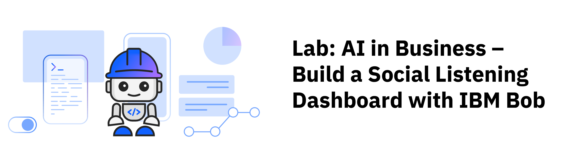

## Overview

Turn real social data into decisions your team can act on — without writing a single line of code. Learn how to use Generative AI with Python and Streamlit to build a social listening dashboard to aggregate and analyze news and social media posts to help a small business owner make informed decisions. Along the way, you'll collaborate with IBM Bob to build a real-world business application step by step, gaining hands-on experience with AI-assisted development, language model integration, and data-driven workflows that mirror what marketing teams use every day.

In this lab, you build an application that scores social posts for sentiment and intent, routes every post into an action queue, lets you triage those queues, tracks week-over-week movement, and exports a weekly brief for the café owner.

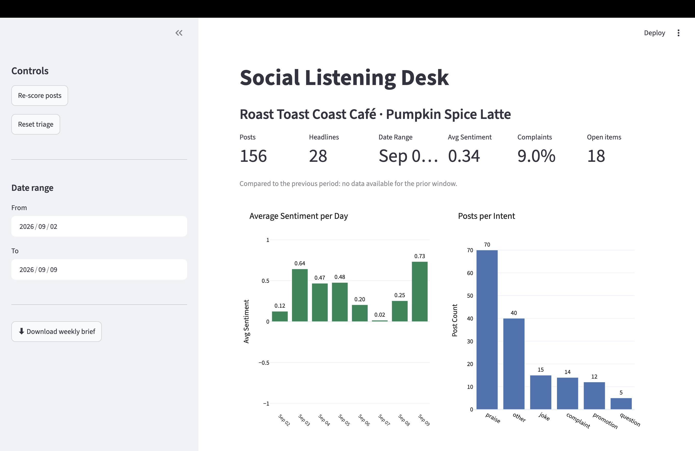

***

## Learning objectives

After completing this lab, you should be able to:

- Build a multi-feature web application using natural-language prompts in IBM Bob.
- Follow an AI-assisted development workflow by generating, reviewing, and refining application features.
- Integrate a language model to classify social posts by sentiment and intent.
- Compare social listening trends across time periods using dashboard controls and metrics.
- Assess routing and triage decisions to identify conversations that require a business response.

***

## About this lab

In this lab, you build an interactive social listening dashboard for **Roast Toast Coast Café**, a fictional independent coffee roaster. The scenario: you are a marketing specialist during pumpkin spice season. The café's own name never appears in the data — your job is to understand what customers and the press are saying about the category and the big chains, and to decide which conversations are worth joining.

The application includes the following features:

- A metrics row showing post volume, average sentiment, and open action items
- Sentiment and intent scoring powered by a language model
- Six action queues that route every post using ordered business rules
- A triage workflow (Handled / Not relevant) that persists across refreshes
- A news panel with competitor tagging and filtering
- A date range control for week-over-week comparison
- A downloadable weekly brief for the café owner

Throughout the lab, you'll guide IBM Bob with clear instructions and specific requirements. IBM Bob will help you build the application using modern web technologies without any prerequisite knowledge of coding. IBM Bob handles the technical details. You'll focus on what you want the application to do, and IBM Bob will create it for you.

**Note:** Bob dynamically responds to prompts; therefore, your application may look different from the screen images shown in this lab. Prompt Bob to make additional changes based on your preferences for the features and user interface.

***

## About the datasets

This lab uses two datasets that include posts and news articles about coffee trends during the Fall season. The data is sourced from the following content aggregators:

- posts.csv: Bluesky API
  - Columns include:
    - post_id
    - author
    - created_at
    - likes
    - reposts
    - text
- news.csv: NEWS API
  - Columns include:
    - published_at
    - source
    - title
    - description
    - url

***

## Estimated time

**60 minutes**

***

## Prerequisites

**Tip:** Right-click the following link, and open the page in a new tab.

Complete the prerequisite tasks of [Get started with IBM Bob](../../get-started-with-ibm-bob.md)

You will also need the following to set up the project: 

- A free Mistral AI account. Create one at [console.mistral.ai](https://console.mistral.ai) (email plus phone verification, no credit card required). The free "Experiment" tier covers this lab many times over.
- The lab data files `data/posts.csv` and `data/news.csv`, provided with the lab.

***

<a name="top"></a>

## Contents

- [Task 1: Set up the project](#task01)
- [Task 2: Create the starter application](#task02)
- [Task 3: Score sentiment and intent](#task03)
- [Task 4: Tag competitors and route posts to queues](#task04)
- [Task 5: Add triage actions](#task05)
- [Task 6: Add the news panel](#task06)
- [Task 7: Add date windowing](#task07)
- [Task 8: Export a weekly brief](#task08)
- [Summary](#summary)
- [Additional resources](#additional-resources)

***

# Preview the tutorial

Watch the following video to see a preview of the steps in this tutorial.

**Note:** Some user interface elements in the video might look different from your IBM Bob environment.

**Tip:** Right-click the following thumbnail image, and open the video in a new tab.

<a href="https://video.ibm.com/embed/channel/23669513/video/ai-in-business">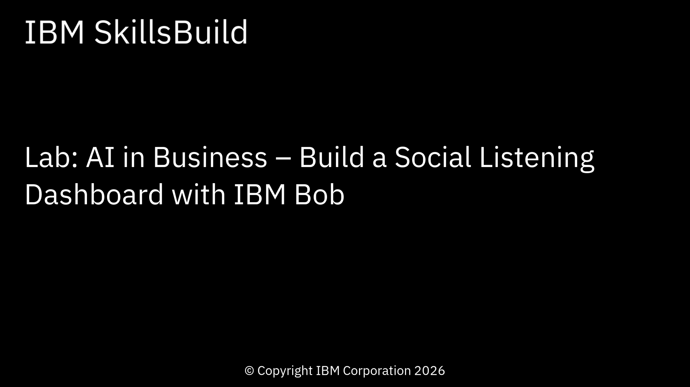</a>

***

<a name="task01"></a>

## Task 1: Set up the project

In this task, you will complete the following tasks to set up the project:

- Create a free Mistral account.
- Create a folder for the lab and download the data files.
- Install the following tools installed on your computer:
  - **Python** - A versatile, high-level, general-purpose programming language known for its clean syntax and extensive ecosystem; widely used in data science, web development, automation, and AI/ML.

  - **Streamlit** - An open-source Python framework for rapidly building and sharing interactive data apps and dashboards — no front-end experience required; turns Python scripts into web UIs with minimal code.

  - **pandas** - A powerful Python library for data manipulation and analysis; provides data structures like DataFrames that make it easy to load, filter, and transform structured data such as CSV files.

  - **Plotly** - An interactive charting library for Python that produces publication-quality charts; works seamlessly with Streamlit to render charts directly in the browser.

  - **mistralai** - The official Python SDK for Mistral AI's language model API; used in this lab to score social posts for sentiment and intent.

  - **python-dotenv** - A small Python library that loads environment variables from a `.env` file into your application at startup, so API keys stay out of your source code.

Don't worry if you don't have these installed yet — IBM Bob will help you check and install them!

## Task 1a: Create a free Mistral account

You will need a **Mistral AI API key**. Follow these steps to create the account and obtain an API key:

1. Go to [console.mistral.ai](https://console.mistral.ai) and create a free account (email plus phone verification, no card required).

   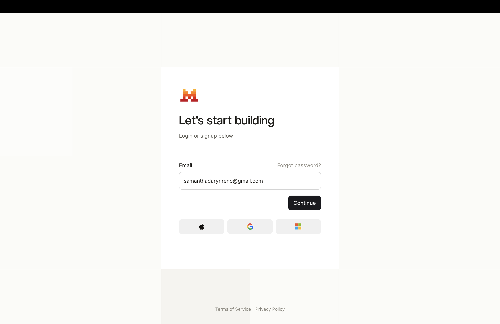

1. In the Mistral console, create a new API key and copy it.

   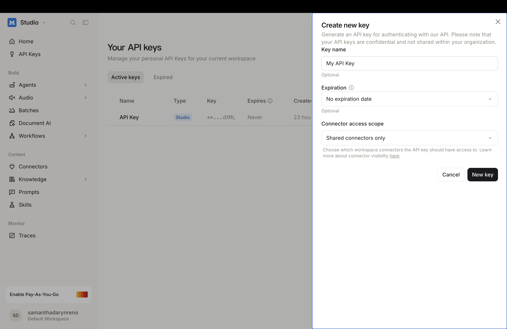

## Task 1b: Set up the project

Follow these steps to create the lab folder and download that datasets:

1. Choose a folder location for the lab work.
1. Download the [data.zip](data.zip) file to your lab folder. The zip file contains `posts.csv` and `news.csv`.
1. In Bob, open the terminal window: click **Terminal > New Terminal**.
1. Use the `cd` command in the terminal panel to move into that folder.
1. Create a folder for your project and unzip the provided data files into it:

   ```
   mkdir ai-in-business
   unzip data.zip -d ai-in-business
   cd ai-in-business
   ```

1. Open the ai-in-business folder:

   1. Click **File > Open Folder**.
   1. Navigate to the **ai-in-business** folder.
   1. Click **Open**.

*Results:* The project folder, *ai-in-business*, contains `data/posts.csv` and `data/news.csv`.

## Task 1c: Set up the environment

Follow these steps to install the tools that you need to complete the lab: 

1. In the Bob chat side panel, select **Agent** mode.

   

1. In the Bob side panel, copy and paste the following prompt to ask Bob to set up and verify the prerequisite environment:

   ```text
   I need to set up a development environment for a Python project in this folder.

   First, create a Python virtual environment called .venv in this folder and use it for everything that follows.
   Then verify I have streamlit, pandas, plotly, mistralai, and python-dotenv installed in that environment.

   If installed, notify me with the versions.
   If not installed, guide me through installation:
   1. First check if I'm using Mac or Windows.
   2. Detect which shell(s) I'm using (bash, zsh, etc.) and test commands in each to find where tools are available.
   3. Use the appropriate shell for all subsequent commands.
   4. Run the appropriate installation commands inside the virtual environment.
   5. Explain each command briefly before running it.
   6. Ask for my confirmation before executing each command.

   Do not ask me whether to use a virtual environment; use the .venv you created.

   Note: On macOS, if tools like Homebrew are installed but not found in the default shell, try using interactive shell mode (e.g., `zsh -i -c 'command'`) to load the full environment profile.
   ```

1. To confirm permission to complete the tasks, click **Approve once** when prompted by Bob, and follow the prompts.

### What Bob does

Bob reports the installed version for all five packages, installed inside `.venv`. If Bob didn't install streamlit, pandas, plotly, mistralai, and pythong-dotenv, then prompt Bob to install tham:

```
Install all of the packages into the environment
```

## Task 1d: Create an .env file

You need a `.env` file to store you Mistral API key. Follow these steps to create the `.env` file:

1. In Bob, open the terminal window: click **Terminal > New Terminal**.

1. Replace `your_api_key_here` with the Mistral API key that you obtained earlier, and then execute the following command in the terminal:

   ```
   echo "MISTRAL_API_KEY=your_api_key_here" > .env
   ```

The following image shows the *ai-in-business* folder:

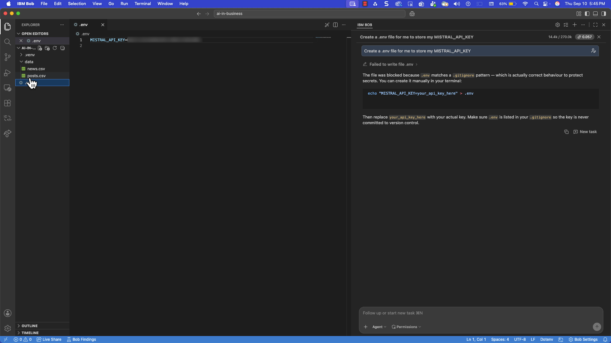

[Back to the top](#top)

***

<a name="task02"></a>

## Task 2: Create the starter application

This task prompts Bob to create a Streamlit application that loads both data files, displays a header with the business name and search term, and shows a metrics row — all built from a single `CONFIG` dictionary so that every later step stays consistent.

Follow these steps to create the starter application:

1. Copy and paste the following prompt into Bob's chat panel.

   ```text
   Create a new Streamlit Python web app in a single file called app.py.

   At the very top of app.py, create a dictionary called CONFIG with these keys and values:
   - business: "Roast Toast Coast Café"
   - term: "pumpkin spice latte"
   - competitors: ["starbucks", "dunkin", "costa coffee", "tim hortons", "greggs", "peet"]
   - promo_words: ["free", "deal", "giveaway", "discount", "offer", "rewards", "today only"]
   - negative: -0.3
   - positive: 0.3
   - high_reach_likes: 10
   - amplify_min_likes: 10
   - label_model: "ministral-8b-2512"

   Everything the app does later should read from CONFIG rather than hard-coding values.

   Load environment variables from a .env file with python-dotenv at startup. Do not print or display the key.

   Load data/posts.csv and data/news.csv with pandas. Parse created_at and published_at as dates. created_at is
   timezone-aware UTC in the file; convert it to timezone-naive at load time with
   pd.to_datetime(..., utc=True).dt.tz_localize(None), and do the same for published_at, so every later date
   comparison in the app is between naive timestamps.
   Cache the loading so it does not re-read the files on every interaction.

   Lay out the top of the page exactly like this, in this order:
   1. Main title: "Social Listening Desk". Use the same text as the browser page title in st.set_page_config.
   2. Directly below the main title, a smaller subheading built from CONFIG — the business name, then " · ",
      then the term in title case — rendering as: Roast Toast Coast Café · Pumpkin Spice Latte.
   3. Below the subheading, a small row of metrics: number of posts, number of headlines, and the date
      range covered by the posts.

   Use a wide layout. Do not add any charts yet.

   Conventions to follow in this prompt and every later one in this project:
   - Do not use emojis anywhere in the app: no emoji page icon, and none in titles, headings, tabs,
     buttons, badges, captions, metric labels, or any text the app writes. Plain text only.
   - For Plotly charts use st.plotly_chart(fig, width="stretch", theme=None). Do not use
     use_container_width (deprecated), and do not use the default theme="streamlit" — it restyles chart
     text to match the app theme, which turns labels pale grey and unreadable against the white chart
     background when the app runs in dark mode.
   - Style every figure explicitly so it looks identical for every user in BOTH light and dark mode:
     in update_layout set template="plotly_white", paper_bgcolor="#ffffff", plot_bgcolor="#ffffff",
     and font=dict(color="#161616") so every chart is a white card with near-black titles, axis
     labels, and tick labels. Set the backgrounds explicitly — do not rely on the template alone,
     and do not let any shared layout dict make chart backgrounds transparent.
   - On every bar chart, print each bar's value directly on or just above the bar in the same
     near-black colour — whole numbers for counts, two decimals for sentiment — so values can be
     read without hovering.
   - When you need counts of a column as a DataFrame, build them as
     df[col].value_counts().rename_axis(col).reset_index(name="count") so the columns are always named predictably.
   - On any chart with dates on the x-axis, format tick labels as short dates like "Sep 03", one tick per day,
     rotated 45 degrees, slightly smaller font.

   Create a requirements.txt listing streamlit, pandas, plotly, mistralai, and python-dotenv.
   Tell me how to run the application from the .venv created in the previous step.
   ```

1. To confirm permission to complete the tasks, click **Approve once** when prompted by Bob, and follow the prompts.

## What Bob does

Bob completes the following tasks based on the prompt:

- Creates a single file `app.py` with a `CONFIG` dict at the top (business, term, competitors, promo words, thresholds, `label_model`)
- Uses`load_dotenv()` at startup; the key is never displayed
- Uses `@st.cache_data` loader to read both CSVs and convert `created_at` and `published_at` with `pd.to_datetime(..., utc=True).dt.tz_localize(None)`, so every later date comparison is naive-vs-naive
- Adds a main title "Social Listening Desk" + subheading built from CONFIG + metrics row (posts, headlines, date range)
- Establishes the project chart conventions used by every later task: `st.plotly_chart(fig, width="stretch", theme=None)`, `template="plotly_white"` with explicit white `paper_bgcolor`/`plot_bgcolor`, `#161616` text, values printed on bars, short-date ticks at 45°

## Explore the application

1. If Bob does not provide the instructins to start the application, ask Bob how to start the application. The instructions should be similar to the following terminal commands:

   ```
   source .venv/bin/activate
   streamlit run app.py
   ```

1. Open a browser, and navigate to the provided URL.

1. Explore the application. Notice the following elements:

   - The main title reads "Social Listening Desk" with "Roast Toast Coast Café · Pumpkin Spice Latte" as a smaller subheading directly beneath it — not merged into one title.
   - The metrics show 156 posts, 28 headlines, and the date range Sep 2 – Sep 9, 2026, and there are no emojis anywhere in the interface. If the counts are zero, the CSV files are not in `data/`.

The following image shows the starter application:

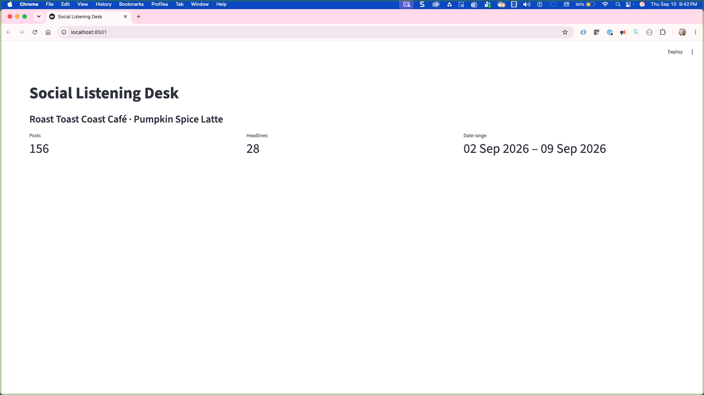

[Back to the top](#top)

***

<a name="task03"></a>

## Task 3: Score sentiment and intent

This task prompts Bob to connect to the Mistral language model and score every post for sentiment (how the author feels) and intent (what kind of post it is). The results are cached so the API is called only once per dataset.

Follow these steps to add sentiment and intent scoring:

1. Copy and paste the following prompt into Bob's chat panel.

   ```text
   Add sentiment and intent scoring to the posts using Mistral's API.

   First, make a cleaned copy of each post's text with URLs and @handles removed (strip the entire handle
   with the pattern @\S+ so dotted handles like @user.bsky.social are fully removed) and whitespace
   collapsed, in a column called clean_text. Keep the original text as well.

   Then, using the mistralai Python SDK and the key from MISTRAL_API_KEY, send the cleaned posts to
   CONFIG["label_model"] in batches of 20. IMPORTANT: the installed SDK is version 2 or later, so the import
   must be exactly `from mistralai.client import Mistral` (NOT `from mistralai import Mistral`, which fails on
   2.x). Create the client with Mistral(api_key=...) and call client.chat.complete(...).
   Use JSON mode (response_format={"type": "json_object"}) and temperature 0. Number the posts in each
   batch [0], [1], [2] ... and use exactly this prompt, filling in the term from CONFIG and the numbered
   posts:

   ---
   You label short public social-media posts for a coffee shop's marketing team.
   The posts mention "{term}". For EACH post, decide:

   - sentiment: a number from -1.0 to 1.0 for how the author feels about the product,
     drink, or experience they describe. Cravings and enthusiasm are positive even if
     the wording is intense or profane. Neutral statements of fact are 0.
   - intent: exactly one of
       complaint  - the author is unhappy with a product, service, price, or experience
       praise     - the author likes or recommends something
       joke       - humour, sarcasm, or a rhetorical remark; not a real opinion
       question   - the author is asking other people something and wants an answer
       promotion  - an advertisement, deal, giveaway, or self-promotion with hashtags or links
       other      - none of the above (e.g. a passing mention, a personal update)

   Return ONLY a JSON object of the form
   {"results": [{"i": 0, "sentiment": 0.7, "intent": "praise"}, ...]}
   with one entry per post, in order, using the same "i" values given.

   Posts:
   {posts}
   ---

   Parse the JSON defensively. The model usually returns {"results": [...]} but sometimes returns the bare
   list; accept both. Accept "i" as a string or a number, and if an entry has no "i" at all, use its position
   in the list. If a batch returns fewer entries than posts, retry it once; if it still comes back short, give
   the missing posts sentiment 0.0 and intent "other" and continue rather than crashing. Store the results in
   two new columns: sentiment (a float, clipped to -1..1) and intent (one of complaint, praise, joke, question,
   promotion, other; anything else becomes "other").
   Wait 1.5 seconds between batches and retry a batch with backoff if the API returns a rate-limit error.

   Save the results to data/labels.json keyed by post_id after the first run, and on later runs load from
   that file instead of calling the API again, so the API is called once per dataset. Add a "Re-score posts"
   button in the sidebar that deletes the cache and calls the API again. Show a progress bar while scoring.

   If MISTRAL_API_KEY is missing, stop with a clear message telling the user to add it to .env.

   Update the metrics row to also show: average sentiment across all posts, and the percentage of posts
   whose intent is "complaint".

   Below the metrics, add a Plotly bar chart of average sentiment per day, with days on the x-axis in date
   order. Colour bars above zero one colour and bars below zero another. Next to it, a bar chart of the
   number of posts per intent, sorted from most to fewest. Under those, a small bar chart of the number of
   posts per day. Follow the chart conventions from the previous prompt.
   ```

1. To confirm permission to complete the tasks, click **Approve once** when prompted by Bob, and follow the prompts.

## What Bob does

Bob makes the following modifications to the application based on the prompt:

- `clean_text` column: strip URLs and `@\S+` handles, collapse whitespace; original text kept
- `from mistralai.client import Mistral` (SDK 2.x); `client.chat.complete(...)` in batches of 20, JSON mode, temperature 0, a fixed labelling prompt with numbered posts
- Defensive parsing: accepts `{results:[...]}` or a bare list, string or int `"i"`, positional fallback, one retry per short batch, `0.0/"other"` defaults on gaps; sentiment clipped to −1..1, intents whitelisted to six labels
- Results cached to `data/labels.json` keyed by `post_id`; a sidebar "Re-score posts" button deletes the cache; progress bar on the first run
- Metrics add average sentiment and complaint share; three bar charts (sentiment per day with diverging colors, posts by intent sorted, posts per day)

## Explore the application

1. Refresh the browser to test the new feature.

1. Explore the application. Notice the following elements:

   - The first load takes 20–40 seconds and shows a progress bar; the second loads instantaneously because the labels are cached in `data/labels.json`.
   - Average sentiment is clearly positive (around +0.3 to +0.4). "praise" is the largest intent by a wide margin, all six intents display, and "complaint" is a small slice (roughly 10%).
   - In Bob, open `data/labels.json` and spot-check a few posts: the labels should match what a person would say.

The following image shows the application with sentiment and intent scoring implemented:

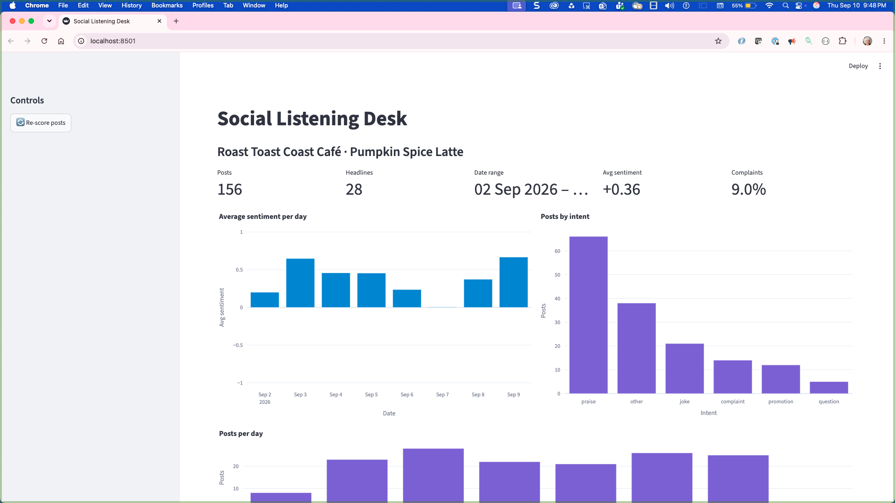

[Back to the top](#top)

***

<a name="task04"></a>

## Task 4: Tag competitors and route posts to queues

This task prompts Bob to add the core business logic of the dashboard: every post is tagged with a competitor name (if one is mentioned) and then routed into exactly one of six action queues. The order of the routing rules matters — each post lands in the first queue whose conditions it meets.

Follow these steps to add competitor tagging and queue routing:

1. Copy and paste the following prompt into Bob's chat panel.

   ```text
   Add competitor tagging and queue routing to the posts.

   Competitor tagging: for each post, find the first name from CONFIG["competitors"] that appears in
   the cleaned text as a whole word, case-insensitive — check the names in the order they appear in the
   CONFIG list and stop at the first hit. Store it in a column called competitor, or leave it empty if
   none match. Then add a boolean column called is_promo that is True when the post mentions
   a competitor AND either contains one of CONFIG["promo_words"] as a whole word or contains a link.

   Routing: add a function called route that assigns each post to exactly one queue using these rules,
   checked in this exact order, stopping at the first match:
   1. If the post mentions a competitor: "competitor promo" if is_promo, otherwise "competitor opinion".
   2. If intent is "promotion", "joke", "question", or "other": "monitor".
   3. If intent is "complaint" and sentiment is below CONFIG["negative"]: "escalate" if likes are above CONFIG["high_reach_likes"], otherwise "respond".
   4. If intent is "praise" and sentiment is above CONFIG["positive"] and likes are above CONFIG["amplify_min_likes"]: "amplify".
   5. Otherwise: "monitor".

   Intent decides which queue a post can enter; sentiment and likes decide whether it is strong enough to get there.

   Store the result in a column called queue.

   Add a dictionary called QUEUE_HELP next to CONFIG with one entry per queue, each a short plain-English
   sentence describing what the queue means and what the marketing specialist should do about it:
   - escalate: "A category complaint that a lot of people saw. A market signal — show the owner today."
   - respond: "A category complaint few people saw. A conversation worth joining from the café's account."
   - amplify: "Category praise that people liked. Join in or reshare it from the café's account."
   - competitor promo: "A rival announced a deal or giveaway. Note it for planning."
   - competitor opinion: "What customers say about rivals. Read it for what they want and don't get."
   - monitor: "Everything else. Nothing to do; it is counted for the trend."

   In the main area, add an expander titled "What the queues mean" that lists all six from QUEUE_HELP.
   Below it, add a row of tabs, one per queue, in this order: Escalate, Respond, Amplify, Competitor promo,
   Competitor opinion, Monitor. Show the count in each tab label. At the top of each tab, show that queue's
   QUEUE_HELP sentence as a caption. Then list the posts in that queue sorted by likes descending. For each
   post show the original text, the date, the sentiment score, likes, and the competitor name if any. Use a
   card or container per post so they are easy to read. Plain text only for tab labels, captions, badges,
   and buttons — no emojis.

   Keep the rules in the route function only; the thresholds come from CONFIG.
   ```

1. To confirm permission to complete the tasks, click **Approve once** when prompted by Bob, and follow the prompts.

## What Bob does

Bob makes the following modifications to the application based on the prompt:

- `tag_competitors()`: first whole-word, case-insensitive match in CONFIG-list order → `competitor`; `is_promo` when a competitor post also has a promo word or a link
- `route()`: five rules checked in order, thresholds from CONFIG only → `queue` (see Config & Routing below)
- `QUEUE_HELP` (one plain-English sentence per queue) and `QUEUE_ORDER` constants
- "What the queues mean" expander + six tabs with counts, the queue's description as a caption, and post cards sorted by likes descending (text, date, sentiment, likes, competitor)

## Explore the application

1. Refresh the browser to test the new feature.

1. Explore the application. Notice the following elements:

   - The six tabs indicate the status of the posts along with the total number of posts for that status.
   - *Monitor* is by far the largest queue. 
   - *Respond* has a handful of posts and every one of them should read as a real complaint about a drink, a price, or a shop.
   - *Escalate* may legitimately be empty (0–1 posts) — an empty *Escalate* next to a populated *Respond* means a quiet week, not a bug.
   - If *Escalate*, *Respond*, and *Amplify* are all zero, the scoring step failed: go back and check Task 3.

The following image shows the application with queue routing implemented:

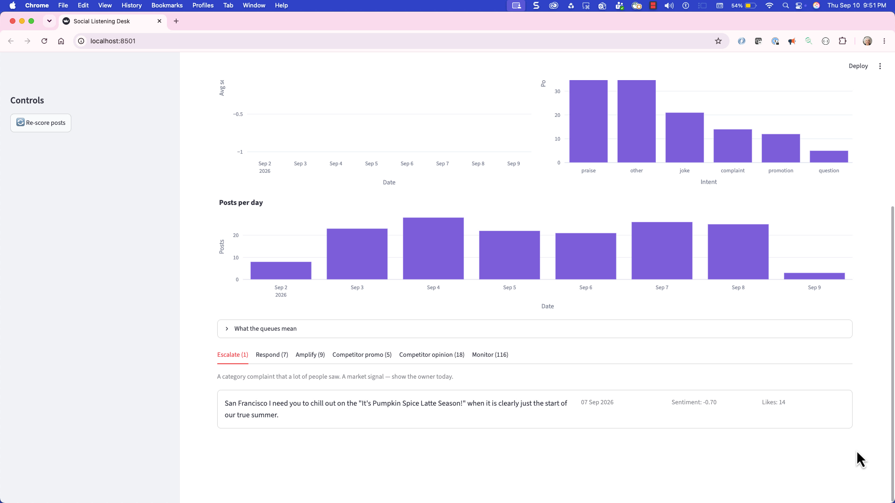

[Back to the top](#top)

***

<a name="task05"></a>

## Task 5: Add triage actions

This task prompts Bob to turn the queues from labels into a to-do list. Each post in the Escalate, Respond, and Amplify queues gets two buttons — "Handled" and "Not relevant" — and the triage state is saved so it survives browser refreshes and app restarts.

Follow these steps to add triage actions:

1. Copy and paste the following prompt into Bob's chat panel.

   ```text
   Add triage actions to the Escalate, Respond, and Amplify tabs.

   For each post card in those three tabs, add two small buttons side by side: "Handled" and "Not relevant".
   - "Handled" marks the post as done. It stays in its queue but moves below a divider labelled
     "Handled" at the bottom of the list, greyed out with a "Handled" badge. "HHandled" posts must render greyed out below a 'Handled' divider in their own tab, with no buttons — do not hide them. Change nothing else. The tab label count shows open posts only.
   - "Not relevant" moves the post to the Monitor queue.

   Post text can contain characters like &, <, >, and quotes; escape it before embedding it in any HTML
   markup so cards never silently fail to render.

   Keep this state in st.session_state keyed by post_id, and persist it to data/triage.json the same way
   the labels are cached: save the file whenever a triage button is clicked, and load it at startup, so
   triage survives browser refreshes and app restarts. Add a "Reset triage" button in the sidebar that
   deletes data/triage.json and clears all handled and moved states.

   In the metrics row, add "Open items" showing the number of posts in Escalate, Respond, and Amplify that
   are not yet handled.
   ```

1. To confirm permission to complete the tasks, click **Approve once** when prompted by Bob, and follow the prompts.

## What Bob does

Bob makes the following modifications to the application based on the prompt:

- *Handled* and *Not relevant* buttons on *Escalate*, *Respond*, and *Amplify* cards.
- *Handled* posts stay visible, greyed out under a *Handled* divider — post text is `html.escape`d before it enters card markup, since raw `&`/`<`/`>` silently kills a card; *Not relevant* reroutes the post to *Monitor*.
- *State* lives in `st.session_state["triage"]` and is written to `data/triage.json` on every click and loaded at startup, so it survives refreshes and restarts; a sidebar *Reset triage* button deletes it.
- Tab labels show open counts; an *Open items* metric totals unhandled posts across the three action queues.

## Explore the application

1. Refresh the browser to test the new feature.

1. Complete the following steps to explore the application:

   1. Under the *Respond* tab, click **Not relevant** on one of the items; it disappears from the tab and the Monitor count goes up by one.
   1. Under the *Escalate* tab, click **Handled** on one of the complaints; the tab count drops, *Open items* drops with it, and the post displays greyed out under a *Handled* divider at the bottom of the same tab — it must not vanish.
   1. If the post vanished, prompt Bob:
      
      ```
      Handled posts must render greyed out below a 'Handled' divider in their own tab, with no buttons — do not hide them. Change nothing else."
      ```
   1. In the side panel, click **Reset triage** to bring everything back, and then refresh the browser: your triage decisions should still be there.

The following image shows the application with triage actions implemented:

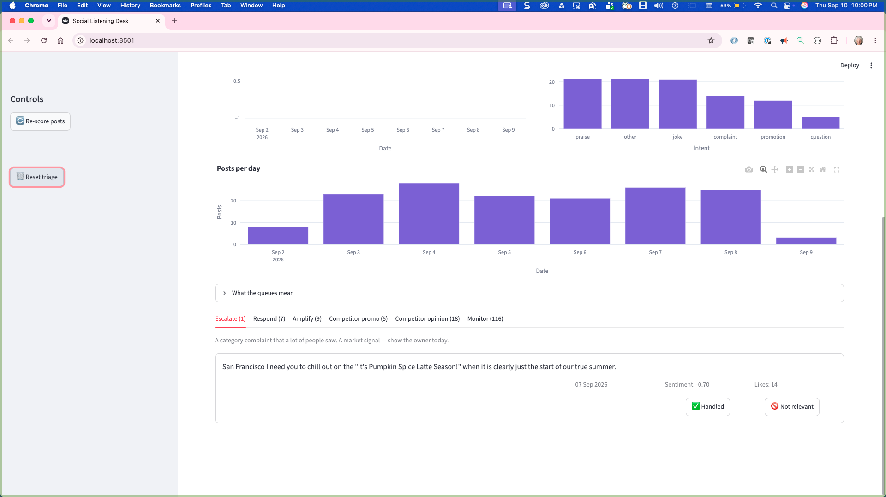

[Back to the top](#top)

***

<a name="task06"></a>

## Task 6: Add the news panel

This task prompts Bob to bring in the second data source. News headlines provide market context — they are not scored or routed, but they are tagged with competitor names and displayed newest-first so you can read the season's calendar at a glance.

Follow these steps to add the news panel:

1. Copy and paste the following prompt into Bob's chat panel.

   ```text
   Add a "Market pulse" section below the queue tabs, using the news data.

   For each headline, find the first competitor from CONFIG["competitors"] that appears in the title or
   description as a whole word, case-insensitive — check the names in the order they appear in the CONFIG
   list and stop at the first hit — and store it in a competitor column. Compute this once,
   where the news data is loaded and the posts get their derived columns, not inside the section that
   displays it; later features will need it too.

   Show a metrics row: number of headlines, number that mention a competitor, and the most-mentioned
   competitor.

   Then show the headlines as a list sorted by date, newest first, with the date, the source, the title
   as a link to the url, and the competitor tag if any. Add a select box above the list to filter by
   competitor, with "All" as the default.

   Do not run sentiment analysis on the headlines and do not route them into queues.
   ```

1. To confirm permission to complete the tasks, click **Approve once** when prompted by Bob, and follow the prompts.

## What Bob does

Bob makes the following modifications to the application based on the prompt:

- `tag_news_competitors()` runs at load time with the other derived columns (never inside the display section), matching title + description in CONFIG-list order.
- *Market pulse*: metrics (headlines, with-competitor, most-mentioned), a newest-first list with date, source, linked title, and competitor tag, and a filter select box defaulting to *All*.
- News is never scored and never routed.

## Explore the application

1. Refresh the browser, and test the new feature.

1. Explore the application. Notice the following elements:

   - Starbucks dominates the headlines (17 of the 19 competitor mentions).
   - Dunkin's fall menu returns on August 19, Starbucks brings the PSL back on August 25 with a wave of coverage, and on September 7 a rumor lands that Dunkin will give away free PSLs the next day.

The following image shows the application with the news panel implemented:

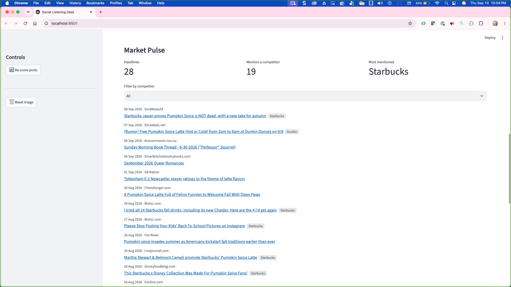

[Back to the top](#top)

***

<a name="task07"></a>

## Task 7: Add date range controls

This task prompts Bob to turn the dashboard from a snapshot into a workflow. A date range control in the sidebar lets you narrow the view to any range within the data, and a "Compared to the previous period" line shows how the numbers changed.

Follow these steps to add date range controls:

1. Copy and paste the following prompt into Bob's chat panel.

   ```text
   Add a date range control to the sidebar that lets the user pick a start and end date within the
   range covered by the posts. Default it to the full range. When filtering, convert the selected dates
   and the previous-period bounds to pandas Timestamps before comparing them with the created_at column,
   so date and datetime types never get mixed.

   Everything in the main area that is based on posts — the metrics row, both daily charts, and every
   queue tab — should recompute for only the posts inside the selected range. Sentiment, competitor tags,
   and queues should not be recalculated; they were computed once at load time and only need to be filtered.
   Triage state (handled, not relevant) is keyed by post_id and should survive changes to the date range.

   Below the metrics row, add a "Compared to the previous period" line that shows the change in post
   count and the change in average sentiment versus the window of the same length immediately before the
   selected start date. If there is no previous data, say so.

   The news section should keep showing the full 30 days regardless of the selected range, since news
   runs on a longer cycle than social posts.
   ```

1. To confirm permission to complete the tasks, click **Approve once** when prompted by Bob, and follow the prompts.

## What Bob does

Bob makes the following modifications to the application based on the prompt:

- Sidebar start/end dates within the posts' range, defaulting to the full range; selected dates and previous-period bounds are converted to `pd.Timestamp` before comparing with `created_at`.
- Metrics, daily charts, and every queue tab recompute on the filtered posts; scores, tags, and queues are filtered, never recalculated; triage is keyed by `post_id` and survives range changes.
- A *Compared to the previous period* line shows Δ posts and Δ sentiment vs the equal-length prior period, with a clear no-data message.
- The news panel always shows the full 30 days.

## Explore the application

1. Refresh the browser to test the new feature.

1. Complete the following steps to explore the application:

   1. Drag the end date back to September 7, then forward to September 8. The Competitor promo tab grows by five posts — that is Dunkin's giveaway landing in the data.
   1. Notice that the *Compared to the previous period* line reflects the change.

The following images show the application with date range controls implemented:

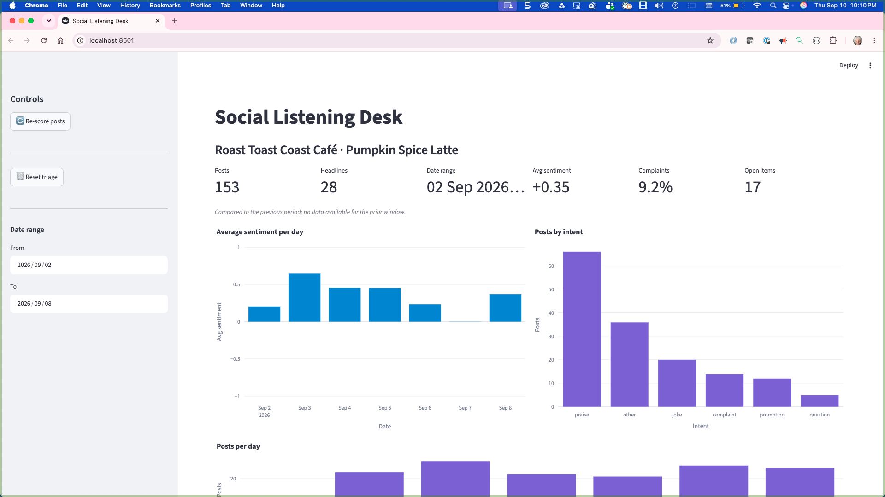

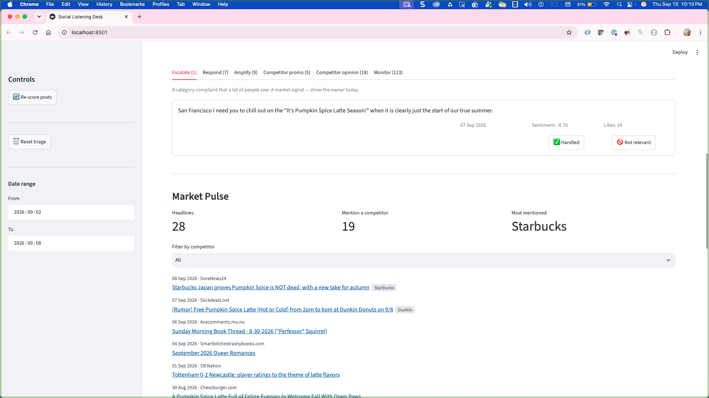

[Back to the top](#top)

***

<a name="task08"></a>

## Task 8: Export a weekly brief

The final task turns the dashboard's analysis into a hand-off document. The specialist's output goes to the café owner, who never opens the dashboard — so the brief needs to stand on its own.

Follow these steps to add the weekly brief export:

1. Copy and paste the following prompt into Bob's chat panel.

   ```text
   Add a "Download weekly brief" button in the sidebar.

   When clicked, it generates a Markdown file for the selected date range containing:
   - A title with the business name, the term, and the date range.
   - The headline numbers: posts, average sentiment, share of complaints, and the change versus the previous period.
   - The count of posts in each queue, and how many in Escalate, Respond, and Amplify are still open versus handled.
   - The three most-liked posts in the Escalate and Respond queues (text, likes, sentiment, intent), or a note that those queues are empty.
   - The three most-liked posts in the Amplify queue.
   - The competitors mentioned in posts, with counts, and the competitors mentioned in headlines, with counts.
   - The five most recent headlines with source and date.

   Offer it for download with st.download_button as brief.md. Do not write the brief to disk — it
   should exist only through the download button. Leave the existing triage and label caches exactly
   as they are.
   ```

1. To confirm permission to complete the tasks, click **Approve once** when prompted by Bob, and follow the prompts.

## What Bob does

Bob makes the following modifications to the application based on the prompt:

- `build_brief()` — a pure function, no disk I/O — assembles Markdown for the selected range: headline numbers, queue summary with open/handled splits, top-3 most-liked posts for Escalate/Respond and for Amplify (with empty-queue notes), competitor counts for posts and for headlines, and the five newest headlines
- A second `with st.sidebar:` block, placed after the windowed values are computed, holds `st.download_button` serving `brief.md` — the brief itself is never written to disk

## Explore the application

1. Refresh the browser to test the new feature.

1. Complete the following steps to explore the application:

   1. In the side panel, click **Download weekly brief** to downloaded `brief.md` file.

   1. Open the downloaded file to read the brief that a café owner could use to take quick action without ever seeing the dashboard.

The following image shows the brief:

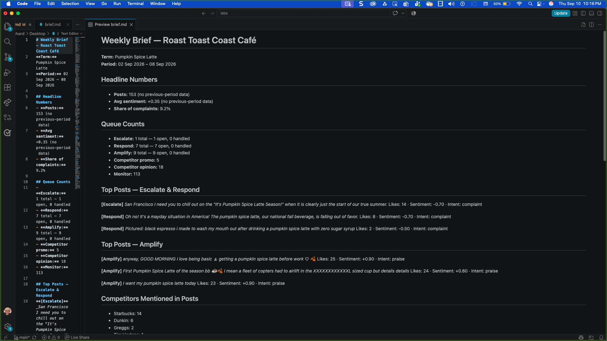

The following image shows the completed application:


**Note:** When you are done, press `CTRL+C` in the terminal window to stop the application.

[Back to the top](#top)

***

<a name="summary"></a>

## Summary

In this lab, you built a social listening dashboard that scores social posts for sentiment and intent, routes every post into an action queue, lets you triage those queues, tracks week-over-week movement, and exports a weekly brief for the café owner.

### What you learned

Now that you have completed this lab, you should be able to:

- Build a multi-feature web application using natural-language prompts in IBM Bob.
- Follow an AI-assisted development workflow by generating, reviewing, and refining application features.
- Integrate a language model to classify social posts by sentiment and intent.
- Compare social listening trends across time periods using dashboard controls and metrics.
- Assess routing and triage decisions to identify conversations that require a business response.

[Back to the top](#top)

<a name="additional-resources"></a>

## Additional resources

- [IBM Bob documentation](https://bob.ibm.com/docs)
- [Mistral AI documentation](https://docs.mistral.ai)
- [Streamlit documentation](https://docs.streamlit.io)
