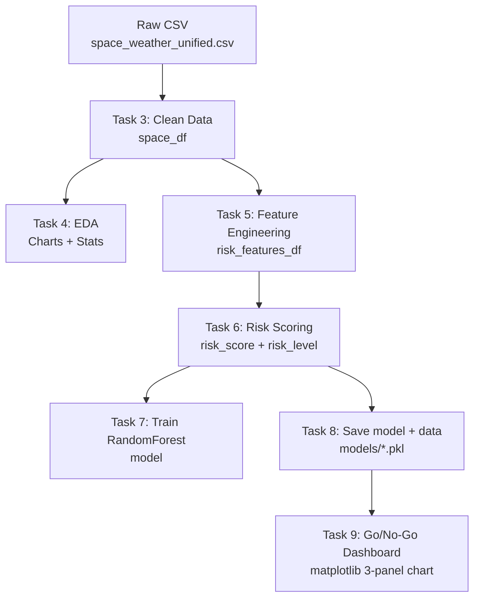
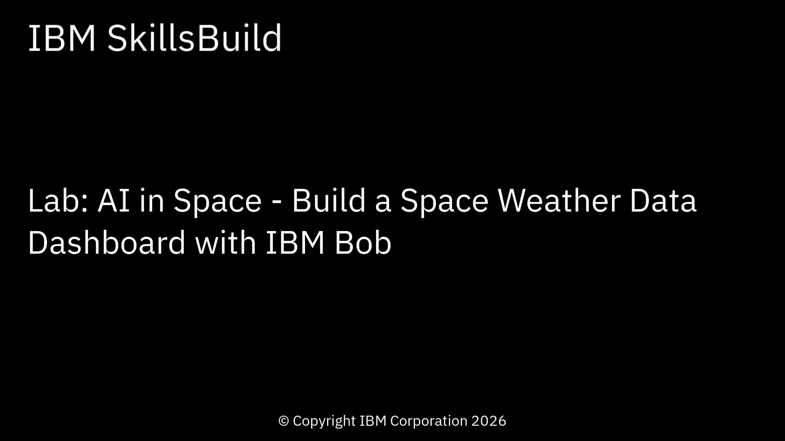

## About this lab

What if you could help decide whether a multimillion-dollar space mission is ready for launch? In this lab, you'll build a **complete machine learning application** that predicts the probability of a space launch using data analysis and machine learning in Jupyter notebooks.

Bob writes all the code for you! You will:
- Read what each step does.
- Copy the prompt to Bob.
- Paste Bob's code and run it to analyze the data and build a machine learning model.
- Review the results.

No deep Python, machine learning, or data science knowledge needed - Leave that to Bob!

## About IBM Bob - Your AI coding partner

> **From "I don't code" to "I built an AI app!" - Bob makes it happen**

IBM Bob lets you:

- **Write code for you** - Just describe what you need, Bob writes it.
- **Understand your project** - Bob reads and comprehends your entire codebase.
- **Debug errors** - Paste an error message, Bob fixes it.
- **Explain concepts** - Ask Bob to explain any code or concept.
- **Work in any language** - Write in Python, JavaScript, Java, and more.
- **Set up environments** - Bob handles installations and configurations.

## Learning objectives

After completing this lab, you will be able to:

- Use IBM Bob to generate Python code for data science workflows.
- Clean and explore a real-world space weather dataset.
- Apply feature engineering techniques to historical space weather data.
- Build a risk scoring model and train a classification model.
- Visualize risk trends and model performance with matplotlib.

**You don't need to be a coding expert** - Bob handles the technical details while you focus on learning and building!

## About the dataset

This lab uses the datasets from [Kaggle dataset: NASA_space_weather_data](https://www.kaggle.com/datasets/edacelikeloglu/nasa-space-weather-data).

This comprehensive dataset contains space weather events collected from NASA's DONKI (Database of Notifications, Knowledge, Information) API. It includes detailed information about solar flares, coronal mass ejections (CMEs), geomagnetic storms, and high-speed solar wind streams that occurred over the past 2 years.

The `space_weather_unified.csv` dataset contains all space weather events in a unified format and includes the following columns:

- event_id: Unique event identifier
- event_type: Event category (Solar Flare, CME, Geomagnetic Storm, High Speed Stream)
- begin_time: Event start timestamp
- peak_time: Peak intensity timestamp (if available)
- end_time: Event end timestamp (if available)
- class_type: Event classification (X5.2, M2.1, G3, etc.)
- source_location: Solar source location coordinates
- active_region: Active solar region number
- date, year, month, day, hour: Time components for analysis
- instruments: Observational instruments used
- note: Additional event descriptions

## Estimated time

**60-90 minutes**

## Architecture flow



## Prerequisites

**Tip:** Right-click the following link, and open the page in a new tab.

Complete the prerequisite tasks of [Get started with IBM Bob](../../ai-in-sports/get-started-with-ibm-bob.md)

<a name="top"></a>

## Contents

- [Task 1: Open Bob in your working directory.](#task01)
- [Task 2: Set up your environment.](#task02)
- [Task 3: Start Jupyter Lab to run the notebook.](#task03)
- [Task 4: Clean up when you're done.](#task04)

# Preview the tutorial

Watch the following video to see a preview of the steps in this tutorial.

**Note:** Some user interface elements in the video might look different from your IBM Bob environment.

**Tip:** Right-click the following thumbnail image, and open the video in a new tab.

<a href="https://video.ibm.com/embed/channel/23669513/video/ai-in-space"></a>

***

<a name="task01"></a>

## Task 1: Open Bob in your working directory

**Note:** This is a manual step, Bob can't do it for security reasons.

Follow these steps to create a directory and open that directory in Bob:

1. Choose a folder location for the lab work.
1. Download the [ai-in-space.zip](ai-in-space.zip) from the IBM SkillsBuild GitHub repository to the folder you chose in step 1.
1. In IBM Bob, verify whether the terminal panel is visible. If you don't see a terminal panel, click **Terminal > New Terminal**.
1. Use the `cd` command in the terminal panel to move into that folder.
1. Execute the following commands to create the directory and unzip the repository.

   ```
   mkdir space-weather-predictor
   cd space-weather-predictor
   unzip ../ai-in-space.zip
   ```
1. Open the `space-weather-predictor` folder:
   1. Click **File > Open Folder**.
   1. Navigate to the `space-weather-predictor` folder.
   1. Click **Open**.

1. Verify that you are in *Ask* mode.

   

1. Copy and paste the following prompt to Bob and review the response:
    ```
    Hey Bob, What's my current working directory?
    ```
1. Verify that the working folder is correct.

[Back to the top](#top)

<a name="task02"></a>

## Task 2: Set up your environment

Follow these steps to set up your environment to complete this lab:

1. Switch to **Agent** mode.

1. In Bob's chat panel, copy and paste the following prompt:

   ```
   Great! Now please setup the necessary environment for Jupyter Lab, 
   but don't install the packages that go inside Jupyter Lab.
   I'll do that part while following the lab.
   ```

1. Click **Approve once** repeatedly when prompted to run the commands to set up the environment.

**What Bob will do:**
- Install Jupyter Lab itself (the application).
- Set up the basic environment.
- Prepare everything needed to run the lab.

**Note:** Bob will NOT install the lab-specific packages (like pandas, scikit-learn, etc.) - you'll install those yourself by following the instructions in the Jupyter notebook.

[Back to the top](#top)

<a name="task03"></a>

## Task 3: Start Jupyter Lab to run the notebook

1. In Bob's chat panel, copy and paste the following prompt:

   ```
   Please run Jupyter Lab for me so that I can start working on the lab.
   Once ready, give me the URL that I should open in a browser.
   ```
1. If prompted, confirm that you want to start Jupyter Lab.

1. Click **Approve once** to run the command to start Jupyter Lab.

   **Note:** You may need to click **Procedd while running** to get the clean URL info.

1. Click the link that Bob provides (or copy-paste it into your browser). Your browser will open Jupyter Lab.
1. If the `ai-in-space.ipynb` notebook does not open, find and open the lab notebook.
1. Follow the instructions in the notebook. Work through each cell, asking Bob for help when needed.

**Tip:** Keep Bob's chat open while you work through the lab. You can ask Bob questions, request code for specific cells, or get help with errors!

[Back to the top](#top)

<a name="task04"></a>

## Task 4: Clean up when you're done

When you've finished the lab, copy and paste the following prompt into Bob's chat panel:

```
I'm all done with the lab! Please stop Jupyter Lab and clean up for me.
```

**What Bob will do:**
- Stop the Jupyter Lab server.
- Clean up any running processes.
- Keep your saved work.

[Back to the top](#top)

<a name="summary"></a>

## Summary

In this lab, you used IBM Bob to build a **complete machine learning application** that predicts the probability of a space launch using data analysis and machine learning in Jupyter notebooks.

### What you learned

Now that you have completed this lab, you should be able to:

- Prompt Bob to help you write machine learning code.
- Debug any issues you encounter.
- Run the code generated by Bob in Jupyter Lab.

[Back to the top](#top)

<a name="additional-resources"></a>

## Additional resources

- [IBM Bob documentation](https://bob.ibm.com/docs)
