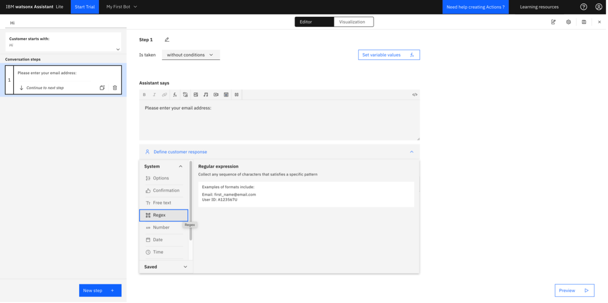

IBM watsonx Assistant, focused on using actions to build customer conversations, is designed to make it simple enough for anyone to build a virtual assistant. Building, testing, publishing, and analyzing your assistant can all now be done in one simple and intuitive interface.

You can use IBM watsonx Assistant to build your own branded live chatbot into any device, application, or channel. Your chatbot, which is also known as an assistant, connects to the customer engagement resources you already use to deliver an engaging, unified problem-solving experience to your customers.

# Learning objectives

After completing this lab, you should be able to:
- Sign up for an IBM Cloud account and provision the IBM watsonx Assistant service.
- Create an assistant.
- Add an action to your assistant based on a template.
- Add an action to your assistant starting from scratch.
- Extract information in session variables.
- Contrast various response types.
- Add a custom extension with dynamic options.

<a name="top"></a>

# Contents

- [Task 1: Create a watsonx Assistant instance in IBM Cloud](#task01)
- [Task 2: Create a chatbot](#task02)
- [Task 3: Create an action from Template](#task03)
- [Task 4: Chitchat action (request/response)](#task04)
- [Task 5: Extract information in session variables](#task05)
- [Task 6: Explore response types](#task06)
- [Task 7: Add a custom extension with dynamic options](#task07)

# Summary

This lab is expected to take 1 hour to complete. At the end of this lab, you will be able to create a chatbot with watsonx Assistant. Your chatbot contains different types of actions that prompt the user for information, extract the user input to use in responses and with third-party services, and provide the user with the answers they requested.

<a name="task01"></a>

# Task 1: Create a watsonx Assistant instance in IBM Cloud

IBM watsonx Assistant is available as a fully managed service on IBM. If you already have an IBM Cloud account, then you can sign in using your IBMId, and then provision the IBM watsonx Assistant service. Otherwise, follow these steps to create a free IBM Cloud account before provisioning the watsonx Assistant service:

1. In a web browser, navigate to <a href="https://cloud.ibm.com" target="_blank">IBM Cloud</a>.
2. Log in with your IBM Cloud credentials, or create an account on IBM Cloud.
3. On the dashboard, click **Create resource**.
4. Select the **AI/Machine Learning** category.
5. Select **watsonx Assistant**.
6. Select the **Lite** plan.
7. Select the **I have read and agree to the following license agreements** checkbox.
8. Click **Create**. When the instance is provision, the watsonx Assistant service instance page displays.
9. In the _Credentials_ section, click **Show Credentials**. You see the _API Key_ and _URL_ for your service. Copy these credentials to the clipboard, to a text file, or leave this page open in IBM Cloud web so that you can easily retrieve the credentials later. <br/>

[Back to the top](#top)

<a name="task02"></a>

# Task 2: Create a chatbot

Now that you have provisioned the IBM watsonx Assistant service, follow these steps to create your first chatbot:

1. In the _Start by launching the tool_ section, click **Launch watsonx Assistant**. You are prompted to create your first assistant.
2. Type a name and description for your assistant, and choose a **language**.
3. Click **Next** to personalize your assistant.
4. On the _Personalize your assistant_ page, make the following selections:
    - Tell us where your assistant will live: **Web**
    - Tell us about yourself:
        - *Which industry do you work in?*: **Banking and financial services**
        - *What is your role on the team building the assistant?*: **Designer**
        - *Which statement describes your needs best?*: **I want to make it easier for my customers to find what they’re looking for in my app**
5. Click **Next** to customize your assistant.
6. On the _Customize your chat UI_ page, make the following selections:
    - Assistant’s name as known by customers: Any name of your choosing
    - Optional: Upload an avatar image
    - Intended purpose: **Standard: For virtual agents and customer support experiences**.
    - Choose a theme: **Light**
    - Colors: Accept the default values
    - Enable streaming: Accept the default value of _Off_
7. Click **Next** to preview your assistant.
8. Optional: Click **Customize web chat** to design your chat UI. When you are done, click **Save and exit**.
9. When you are satisfied with your settings, click **Create** to create your assistant.

[Back to the top](#top)

<a name="task03"></a>

# Task 3: Create an action from template

You can add an action to your assistant either based on a template, or by manually adding custom actions. Follow these steps to add an action based on a template:

1. On the _Assistant Builder Home_ page, click **Build actions**.
2. Click **Create action** to add a new action to your assistant. <br/>
3. Choose the method to build your action. The options are:
    - **Start from scratch:** Build with actions using your own use case.
    - **Quick start with templates:** Use one of our pre-built templates and use cases.

    In this case, choose **Quick start with templates.** <br/>

1. Select the **“Book a Meeting”** template. <br/>
2. Review the information in the _What your customer says_, _What your assistant collects_, and _Pre-build features_ sections.
3. Click **Select this template**.
4. In the side panel that displays, note that the _Book a meeting_ template is listed, and then click **Add templates**. <br/>
5. Click **Preview** to test your new assistant. For example, ask the assistant:
   ```
   I’d like to book a meeting
   ```
6. Optional: Select the **Book a meeting** template to customize it further.

[Back to the top](#top)

<a name="task04"></a>

# Task 4: Chitchat action (request/response)

Now that you have added an action to your assistant based on a template, follow these steps to add a custom action manually:

1. Click **New** action to create a another action for your assistant. <br/>
2. Choose **Start from scratch** to build an action based on your own use case. <br/>
3. Type a greeting for the text that your customer will use to start this interaction, and click **Save**. For example:
   ```
   Hello
   ```
   <br/>
4. In the *Assistant says* field, type to define a static response returned by the assistant:
   ```
   Hi, how are you?
   ```
   <br/>
5. Optional: Click **New step** to add additional steps to define a more sophisticated flow for the conversation. For example:
    1. Add a step where the assistant says
       ```
       Do you need help with your account today?
       ```
    2. Define the customer response to be **Confirmation**.
6. Click the **Visualization** tab to see a visual representation of the conversation flow.
7. Click **Preview** to test your new assistant. For example, start the conversation with:
   ```
   Hello
   ```
8. Close the action window.

[Back to the top](#top)

<a name="task05"></a>

# Task 5: Extract information in session variables

In this task, you will extract information provided by the user via chat and store it in a context variable. See <a href="https://cloud.ibm.com/docs/watson-assistant?topic=watson-assistant-manage-info#store-session-variable" target="_blank">Using variables to manage conversation information</a> for more details.

<a name="task05a"></a>

### Task 5a: Create the action

Follow these steps to create the action to prompt the user for their email address:

1. Click **New action**.
2. Choose **Start from scratch**:
3. Type an example phrase that will start the conversation, and click **Save**. For example, start the conversation with:
    ```
    Hi
    ```
4. Type the text that the assistant says. For example:
   ```
   Please enter your email address: 
   ```
5. Click **Define customer response**, and then follow these steps:
    1. Select **Regex**. <br/>
    2. For the _Regular_ expression, select **Email**. <br/>
    3. Click **Apply**.
6. Click **Next step** to create a new step.
7. Type the text that the assistant says to confirm the email. For example:
   ```
   Please confirm your email address: 
   ```
8. Click the **Insert a variable** icon .
9. From the context menu, choose **Action step variables > 1. Please enter your email address**. <br/><br/>With this configuration, the assistant can access the email address provided by the user in the previous step, and display the email address in its response. <br/>
10. Click **Define customer response > Confirmation** to present the user with Yes and No buttons. <br/>
12. Click the **Visualization** tab to see a visual representation of the conversation flow.
13. Click **Preview** to test your new assistant. For example, start the conversation with:
    ```
    Hi
    ```
14. Close the action window.

[Back to the top](#top)

<a name="task05b"></a>

## Task 5b: Add the variable to the action

Follow these steps to create a variable in Step 2 to store the user's saved email address:

1. With Step 2 selected, click **Set variable values** to create a session variable to store the question.
1. Click **Set new value > New session variable**.
1. On the _Session variable_ window, complete the following fields:
   - _Name_: `Email`
   - _Variable ID_: `Email`
   - _Type_: **Free text**
1. Click **Apply** to save the variable.
1. For *To*, choose **Action Step Variables** > **1. Please enter your email address**.<br/>

<a name="task05c"></a>

## Task 5c: Display the saved email to the user

Follow these steps to create a step that displays the saved email address to the user:

3. Click **New step**.
4. Type the text that the assistant says to tell the user that their email was saved. For example:
   ```
   Saved email address: 
   ```
5. Click the **Insert a variable** icon .
6. From the context menu, choose **Session variables > Email**. With this configuration, session variables can be set in one action, and then used by all other actions. <br/>
7. Select **And then** > **End the action** to complete the action.
8. Click the **Visualization** tab to see a visual representation of the conversation flow.
9. Click **Preview** to test your new assistant. For example, start the conversation with:
   ```
   Hi
   ```

[Back to the top](#top)

<a name="task05d"></a>

## Task 5d: Explore conditions for handling responses

In Task 5a, you request a confirmation (Yes or No) response from the user; however, you don't treat the user's responses separately. In this scenario, the third step of the action is the end of the action, which should only be reached if the user agrees with the saved email. Follow these steps to explore conditions for handling both responses appropriately:

1. In Step 3, from the _Is taken_ drop-down list, **with conditions**.
2. Review the populated condition as _If All of this is true:_ **2\. Please confirm your email address** **is** **Yes**. <br/><br/>The next case occurs when the user answers **No**; in which case we simply loop back and repeat the action from Step 1.
3. Click **New step**.
4. From the _Is taken_ drop-down list, **with conditions**.
5. Set the condition to _If All of this is true:_ **2\. Please confirm your email address** **is** **No**.
6. For the _And then_ field:
    1. Select **Re-ask previous step(s)**.
    2. Select steps **1**, **2**, and **3**.
    3. Click **Apply**. <br/>
7. Click the **Visualization** tab to see a visual representation of the conversation flow.
8. Click **Preview** to test your new assistant. For example, start the conversation with:
    ```
    Hi
    ```
9. Close the action window.

[Back to the top](#top)

<a name="task06"></a>

# Task 6: Explore response types

You can specify choices for the user to select as a response. In this task, you create an action with different response types.

<a name="task06a"></a>

## Task 6a: Create a new action

Follow these steps to create an action with multiple example phrases that a user might type to initiate the conversation:

1. Click **New action** to create a another action for your assistant.
2. Choose **Start from scratch** to build an action based on your own use case.
3. Type the following for the text that your customer will use to start this interaction, and click **Save**.
   ```
   Hello, show me the different response types
   ```
   <br/>
4. Click the **Customer starts with** section.
5. In the _Add example phrases_ section, add more example phrases that the customer might use to initiate the conversation. For example:
   ```
   What response types are available?
   ```
   Adding additional example phrases helps your assistant to better understand the customer's needs: <br/><br/>
   Now that watsonx Assistant knows how to start this action, you need to configure the steps that define the interaction between watsonx Assistant and the customer.

[Back to the top](#top)

<a name="task06b"></a>

## Task 6b: Create the first step in the action

Follow these steps to add a step that specifies options for the user to select as a response:

1. Click the first step which is currently empty.
2. In the *Assistant says* field, type the following to see an example of different response types: to define a static response returned by the assistant.
   ```
   Please select one of the following options: 
   ```
3. Select **Define a customer response > Options**, type the following options, and then click **Apply**.
    - **Image**
    - **Video**
    - **Audio**
    - **Iframe**
    - **Stop** <br/>

[Back to the top](#top)

<a name="task06c"></a>

## Task 6c: Add conditions for each response

Follow these steps to respond to the user differently based on the option that the user selected:

1. Click **New step** to add a condition.
2. From the _Is taken_ drop-down list, **with conditions**.
3. Review the populated condition as _If All of this is true:_ **1\. Please select one of the following options to see an example of different response types: is Image**. This condition indicates that this step is only considered if the user has selected the *Image* option in the previous step. <br/>
4. In the _Assistant says_ section, click the **Image** icon .
    1. Search for an image online to display, and copy the image URL.
    1. In the _Source_ URL field, paste the image URL. For example:

        ```
        https://www.ibm.com/content/dam/connectedassets-adobe-cms/worldwide-content/cdp/cf/ul/g/2a/6d/ibm-watsonxai-a04.component.cta-section-item-xl.ts=1734470596461.png/content/adobe-cms/us/en/watson/jcr:content/root/table_of_contents/content_section_styl/content-section-body/cta_section/container/cta_section_row/cta_section_item/image
        ```

    1. Complete the additional fields on the form.
    1. Click **Apply**: <br/>

1. In the _And then_ field, select **Re-ask previous step(s)** to create a loop.
    - Select the first step.
    - Click **Apply**.
2. Repeat these steps to add three additional steps for the other responses:
    - Click the **Video** icon : **2\. Please select one of the following options to see an example of different response types: is Video**: Add a video URL for the assistant’s response. For example:

    ```
    https://youtu.be/WZMJHh4yz6g?si=REN-PEk3dgzl7TCa
    ```

    - Click the **Audio** icon :  **3\. Please select one of the following options to see an example of different response types: is Audio**: Add a URL to embed the audio, for example:

    ```
    https://watson-developer-cloud.github.io/doc-tutorial-downloads/text-to-speech/samples-latest/en-US_EmmaExpressive.wav
    ```

    - Click the **Iframe** icon : **4\. Please select one of the following options to see an example of different response types: is Iframe**:
      - Add a URL to embed in an iframe, for example:
    ```
    https://video.ibm.com/embed/channel/23952663/video/wa-search
    ```
      - Enable **Display iframe inline**.
    - **5\. Please select one of the following options to see an example of different response types: is Stop**. To avoid an infinite loop, set the _And then_ action to **End the action** rather than repeat the steps. With this setting, the action stops when the user chooses the option **Stop** in Step 1. <br/>

1. Click the **Visualization** tab to see a visual representation of the conversation flow.
2. Click **Preview** to test your new assistant. For example, start the conversation with one of the example phrases.
3. Close the action window.

[Back to the top](#top)

<a name="task07"></a>

# Task 7: Add a custom extension with dynamic options

You can add a custom extension that integrates with IBM or third party services to provide dynamic responses to users. Follow these steps to create a custom extension and add it to an action:

## Task 7a: Sign up for the watsonx trial

You can use watsonx to answer a user's question. Follow these steps to sign up for the watsonx trial:

1. Navigate to <a href="https://dataplatform.cloud.ibm.com/registration/stepone?context=wx" target="_blank">Try IBM watsonx.ai for free</a>.
1. Click **Create account or log in**.
1. Since you are already logged in, click **Continue to console**.
1. Wait while the services are provisioned, then close the *Welcome to watsonx* and *Dive deeper* screens.

Follow these steps to open your sandbox project, and associate your machine learning service with the project:

1. From the watsonx home screen, scroll to the *Projects* section.
2. Select your sandbox project.
3. Click the **Manage** tab.
4. Select the **Services & integrations** page.
5. Click **Associate service**.
   1. Select your **watsonx.ai Runtime** service.
   1. Click **Associate**.


To call the watsonx service, you need credentials. Follow these steps to create a API key and obtain your project ID:

1. Click **IBM watsonx** to return to the home screen, and scroll to the *Developer access* section.
1. In the *Project or space* drop-down list, select your sandbox project.
1. Next to the *Project ID*, click the **Copy** icon . Save this ID to a text file to be used later.
1. Click **Create API key**.
1. Provide a name, such as:
   ```
   watsonx API key
   ```
1. Click **Create**.
1. Click **Copy**, and save it to a text file to be used later.
1. Click **Download** to save the API key in a JSON file for future use.


[Back to the top](#top)

## Task 7b: Create a custom extension

Now you are ready to create a custom extension which includes the watsonx OpenAPI spec. Follow these steps to set up the integration with the IBM service:

1. From the **Home** menu, choose **Integrations**. <br/>
2. Scroll down to the _Extensions_ section, and click **Build custom extension**. <br/>
3. On the _Get started_ screen, click **Next**.
4. For the _Extension name_, type the following name, and click **Next**.
   ```
   My watsonx extension
   ```
5. Download the <a href="https://github.com/watson-developer-cloud/assistant-toolkit/blob/master/integrations/extensions/starter-kits/language-model-watsonx/watsonx-openapi.json" target="_blank">watsonx-openapi.json file</a> from the github responsitory.
6. Drag the JSON file onto the _Import OpenAPI_ screen, and then click **Next**.
7. Click **Finish**. <br/>
8. For _watson extention_, click **Add**.
    1. Confirm that you want to **Add** the custom extension.
    2. On the _Get started_ screen, click **Next**.
    3. On the _Authentication_ screen, complete the following fields:
       - *Authentication type*: **OAuth 2.0**
       - *Grant type*: **Custom apikey**
       - *APIkey*: Paste your API key from the previous task
       - *Client authentication*: **Send as Body**
       - *Servers*: Accept the listed server
       - *region*: Select the region where you set up your account
    1. Click **Next**.
    4. Review the operations, and then click **Finish**.<br/>

[Back to the top](#top)

## Task 7c: Create an action

Next, you can create an action where the user can ask watsonx a question. Follow these steps to create an action:

1. In the *All items > Created by you* section, click **New action**.
1. Select **Start from scratch**.
1. For the question, type:
   ```
   Can I ask watsonx a question?
   ```
1. Click **Save**.

## Create the first step

Follow these steps to ask the user to type their question:

1. Create a new step with the following properties:
    - *Assistant says*:
      ```
      Sure! What is your question?
      ```
    - *Define customer response*: **Free text**

## Create the second step

Follow these steps to create the second step which will confirm the user's question:

### Session variable

1. Create a new step.
1. Click **Set variable values** to create a session variable to store the question.
1. Click **Set new value > New session variable**.
1. On the _Session variable_ window, complete the following fields:
   - _Name_: `question`
   - _Variable ID_: `question`
   - _Type_: **Free text**
1. Click **Apply** to save the variable.
1. For *To*, choose **Action Step Variables** > **1. Sure! What is your question?**.

### Assistant says

1. In the *Assistant says* field, type:
   ```
   Getting your answer from watsonx: 
   ```
1. Click the **Insert a variable** icon .
2. From the context menu, choose **Action step variables > 1. Sure! What is your question?**.

### And then

1. In the _And then_ field, select **Use an extension**.
1. For the _Extension_, select **My watsonx extension**.
1. For the _Operation_, select **Generation**.
1. Select the following parameters:
   - **version**:
     ```
     2023-5-29
     ```
   - **input**: From the context menu, choose **Session variables > question**.
   - **model_id**: Enter text:
     ```
     ibm/granite-3-3-8b-instruct
     ```
   - **project_id**: Enter text: Paste your project ID.
1. Optional: Set any other additional parameters. For example, set the *parameters.max_new_tokens* to `300`.
1. Click **Apply**.<br/>

Follow these steps to create a third step to show the response from watsonx to the user:

### Session variable

1. Create a new step.
1. Click **Set variable values**.
1. Click **Set new value > New session variable**.
3. On the _Session variable_ window, complete the following fields:
   - _Name_: `response`
   - _Variable ID_: `response`
   - _Type_: **Free text**
4. Click **Apply** to save the variable.
5. For *To*, choose **Expression**.
   1. Type `$` to display the *Insert a variable* context menu.
   2. Choose **My watsonx extension(step2) > body.results**.
   3. Add the text:
      ```
      [0].generated_text
      ```
   4. Click **Apply**.

### Assistant says

1. In the *Assistant says* field, type:
   ```
   The answer to your question, 
   ```
2. Click the **Insert a variable** icon .
3. From the context menu, choose **Action step variables > 1. Sure! What is your question?**.
4. Type:
   ```
   , is 
   ```
5. Click the **Insert a variable** icon .
6. From the context menu, choose **Session variables > response**.
    
### Condition

1. In the _Is taken_ field, select **with conditions**.
1. In the _Conditions_ field, choose **My watsonx extension (step2) > Ran successfully**. The rest of the condition is completed for you: `== true`.

### And then

1. Select **And then** > **End the action** to complete the action.<br/>

## Task 7d: Test the action

1. Click the **Visualization** tab to see a visual representation of the conversation flow.
1. Click **Preview** to test your new assistant. For example, start the conversation with:
   ```
   Can I ask watsonx a question?
   ```
   <br/>
1. Close the action window.

[Back to the top](#top)

# Summary
In this lab, you learned how to complete the following tasks:
- Sign up for an IBM Cloud account and provision the IBM watsonx Assistant service.
- Create an assistant.
- Add an action to your assistant based on a template.
- Add an action to your assistant starting from scratch.
- Extract information in session variables.
- Contrast various response types.
- Add a custom extension with dynamic options.

[Back to the top](#top)

# Next steps
Return to the course to complete the module and assessment.