# Disclaimer

Please note that some of the outputs that you will generate will not match the outputs discussed in this lab. Your goal is not to recreate the outputs line by line but to get hands on experience using the Prompt Lab, prompting a foundation model, and see how changing different settings and parameters can influence the results.

The reason for differing results is because watsonx.ai is being developed and released in an agile manner. In addition to the above, the web interface is likely to change over time. Therefore, the screenshots used in this lab may not always look exactly like what you see. You can expect to encounter some of the following:

- Additional foundation models in the library list.
- Changes in the user interface (location of buttons, text for various fields)
- Additional tabs/buttons (especially when the Tuning Studio is rolled out)

These differences should not affect how the labs work.

There are three changes, however, that can affect the results:

- Foundation models can be very sensitive to input. If you enter slightly different text than what the exercise is using (even if it is just one single word), the outcome can be different.
- The foundation models are tuned continuously. If the models themselves are updated, then results may vary.
- The sample prompts might change (more can be added, or updated with new text). Since prompt examples are used heavily in this lab, this can affect what you might see. To mitigate that, the prompt example text used will be provided in a gray text box. If you select a prompt example and the text is different, simply copy the given text into various input fields.

# Learning objectives

In this lab, you will complete the following tasks:

- Contrast the different Prompt Lab modes.
- Compare the strengths and weaknesses of different models.
- Test different configuration parameters to how they influence a model in generating output.
- Differentiate zero-shot prompting, one-shot prompting, and few-shot prompting.
- Generate list and JSON files with foundation models.
- Save prompts and prompt sessions.
- Restore a saved prompt to an earlier state via prompt history.
- Save prompts to a Jupyter notebook and work with the Jupyter notebook.

**Note**: This lab does not provide an overview of the watsonx user interface. The videos in the course provide several examples of how to navigate the user interface.

<a name="top"></a>

# Contents

- [Part 1: Use the Prompt Lab](#task01)
- [Part 2: Explore prompt results in another data format (JSON)](#task02)
- [Part 3: Work with prompts in a Jupyter notebook](#task03)

# Summary

At the end of this lab, you will be able to open a new Prompt Lab session and navigate the watsonx.ai interface, including selecting and experimenting with different foundation models. You will understand the importance of prompt engineering and how to modify prompts familiar with zero-shot, one-shot, and few-shot prompting techniques and how to use them effectively. Additionally, you will learn to adjust inference parameters such as temperature, top P, and top K to influence model outputs. You will also be able to generate structured outputs like lists and JSON, and use stop sequences to control model generation. Finally, you will know how to save prompts and prompt sessions, and understand the importance of testing model outputs, especially for code-based tasks.

<a name="task01"></a>

# Part 1: Use the Prompt Lab

## Task 1a: Open your sandbox project

When you signed up for the [watsonx free trial](https://dataplatform.cloud.ibm.com/registration/stepone?context=wx), a sandbox project was created for you. Follow these steps to open the project and associate your watsonx.ai Runtime service with the project:

1. From the watsonx home screen, scroll to the **Projects** section.
2. Select your sandbox project.
3. Click the **Manage** tab.
4. Select the **Services & integrations** page.
5. Click **Associate service**.
6. Select your **watsonx.ai Runtime** service.
7. Click **Associate**.

[Back to the top](#top)

## Task 1b: Open the Prompt Lab

The Prompt Lab is available within a project. Follow these steps to open the Prompt Lab:

1. Click **IBM watsonx** to return to the home screen.
2. Verify that your sandbox project is selected as highlighted in the following image:<br/>
   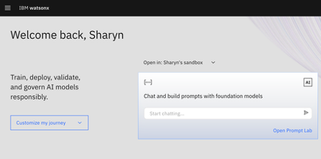
3. Click **Open Prompt Lab**.
4. If prompted, acknowledge the terms by checking each of the checkboxes. Then choose to either **Skip tour** or **Start tour**.

[Back to the top](#top)

## Task 1c: Choose the right foundation model

Foundation models are large-scale pre-trained models that serve as the base for various AI applications. See [Supported foundation models in watsonx.ai](https://dataplatform.cloud.ibm.com/docs/content/wsj/analyze-data/fm-models.html?context=wx) for a complete list of supported foundation models. Follow these steps to select a foundation model:

1. Select the **Model** drop-down list to **View all foundation models**.<br/>
   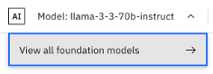
2. Click the **Filter** icon .
3. Explore filtering the models by **Task**, **Provider**, or **Model type**.
4. Select the **Model benchmarks** tab to help you choose the best model.
5. Select a model to view its model card.
6. Click **Select model**.

## Task 1d: Use the sample prompts

If you’re not sure how to begin, sample prompts can get you started. Follow these steps to use the sample prompts:

1. Open the **Sample prompts** icon  to display the list.
2. Scroll through the list, and click the **Marketing email generation** sample prompt.
3. View the selected model. When you load a sample prompt, an appropriate model is selected for you.
4. Click **Generate** to submit the sample prompt to the model, and see the sample email output.
5. Open the **Model Parameters** panel . The appropriate decoding and stopping criteria parameters are set automatically. Explore changing model parameters to compare the output.</br>
    **Note:** The model parameters vary based on the currently selected model.
6. Explore generating output using different sample prompts.

[Back to the top](#top)

## Task 1e: Save your work

You can save your work in three formats:

| **Asset type** | **Description** |
| --- | --- |
| Prompt template | Save the current prompt only, without its history. |
| Prompt session | Save history and data from the current session. |
| Standard notebook | Save the current prompt as a notebook. |

Follow these steps to save your work:

1. Click **Save work > Save as**.
2. Select **Prompt session**.
3. For the name, type:
   ```
   Sample prompts
   ```
4. Select the **View in project after saving** option.
5. Click **Save**.
6. On the project's *Assets* tab, click the **Sample prompts** asset to load that prompt in the Prompt Lab and get right back to work.
7. Click the **Saved prompts** icon  to see saved prompt from your sandbox project.

[Back to the top](#top)

## Task 1f: Use Chat mode

You can chat with the foundation model to see how the model handles dialog or question-answering tasks. If you’re not sure where to start, you can use any of the quick start samples. Follow these steps to use Chat mode in the Prompt Lab:

1. Click the **Chat** tab.
2. Click the **Create a chart of the top NLP use-cases for foundation models** sample.
3. Click **Clear chat** to start a new chat session.
4. Click the **Edit system prompt** icon .
5. Provide the foundation model with specific information. For example:
   ```
   when referring to a “company”, assume the company name is "Golden Bank"
   ```
6. Click **Save**.
7. Ask some questions. Notice that the Chat mode remembers the context of the chat, so you can ask follow up questions. Also notice that the answers refer to Golden Bank because you specified the company name in the system prompt settings.
   Experiment with the following questions:
    - Who is the company?
    - What is a stock anomaly?
    - How can I detect them?
    - Why would a company need to perform this type of analysis?
    - Where can I get historical stock data?
    - Give me a list of relevant news articles for the 2024 stock performance for IBM.
2. Save your work as a prompt session with the name:
   ```
   Chat mode prompts
   ```

For more information on grounding with documents, , refer to the [Prompt Lab](https://dataplatform.cloud.ibm.com/docs/content/wsj/analyze-data/fm-prompt-lab.html?context=wx#chat-mode) topic in the documentation.

[Back to the top](#top)

## Task 1g: Use Freeform mode

You can type your prompt text in a freeform, plain text editor, and then click **Generate** to send your prompt to the model. Follow these steps to use the Prompt Lab in Freeform mode:

1. Click the **Freeform** tab to prompt a foundation model in Freeform mode.
2. Copy and paste the following text in the text field.
    ```
    Classify this customer message into one of two classes: question, problem.

    Class name: Question

    Description: The customer is asking a technical question or a how-to question about our products or services.

    Class name: Problem

    Description: The customer is describing a problem they are having. They might say they are trying something, but it's not working. They might say they are getting an error or unexpected results.

    Message: I'm having trouble registering for a new account.

    Class name:
    ```

1. Click **Generate** to see the output for the *Class name: Problem*.
2. Save your work as a prompt session with the name:
  ```
  Freeform mode prompts
  ```

[Back to the top](#top)

## Task 1h: Use Structured mode

You can type your prompt in a structured format. The structured format is helpful for few-shot prompting, when your prompt has multiple examples. Follow these steps to use the Prompt Lab in Structured mode:

1. Click the **Structured** tab.
3. In the Instruction field, copy and paste the following text:  
   
   ```
   Given a message submitted to a customer-support chatbot for a cloud software company, classify the customer's message as either a question or a problem description so the chat can be routed to the correct support team.
   ```
4. In the *Setup* field, copy and paste the following text in each column:

   | **Input** | **Output** |
   | --- | --- |
   | When I try to log in, I get an error. | Problem |
   | Where can I find the plan prices? | Question |
   | What is the difference between trial and paygo? | Question |
   | The registration page crashed, and now I can't create a new account. | Problem |
   | What regions are supported? | Question |
   | I can't remember my password. | Problem |

1. In the *Try* field, copy and paste the following text:
   ```
   I'm having trouble registering for a new account
   ```
2. Click **Generate** to see the output *Problem*.
3. Experiment with changing the selected foundation model to generate different output.
4. Save your work as a prompt session with the name:
   ```
   Structured mode prompts
   ```

[Back to the top](#top)

<a name="task02"></a>

# Part 2: Explore prompt results in another data format (JSON)

In this task, you will use the Prompt Lab to generate a simple JSON file, experimenting with different models to see how they handle structured output. While some models excel in generating natural language text, others are better suited for producing valid JSON outputs. Additionally, you will explore the use of Stop sequences to control the model's output and prevent unwanted text generation.

**Note:** If you do not see the models used in this task in the Prompt Lab, refer to the [Foundation model lifecycle](https://dataplatform.cloud.ibm.com/docs/content/wsj/analyze-data/fm-model-lifecycle.html?context=wx) topic to find the recommended alternative model.

[Back to the top](#top)

## Task 2a: Generate a response using a flan model

Follow these steps to prompt a flan foundation model:

1. In the Prompt Lab, click **New prompt** in Structured mode.
2. Verify that that the **flan-ul2-20b** model is selected.
3. In the _Model parameters_, set the following parameters:
    - **Decoding** to **Sampling**
    - **Max tokens** to `200`
    - **Min tokens** to `0`
    - **Temperature** to `0.7`
    - **top K** to `50`
    - **Top P** to `0.5`
    - **Repetition penalty** to `1.2`
4. In the _Try_ section, copy and paste the following text into the Input field:

    ```
    Create a JSON file output with the following information
       
    name: Joe age: 25

    Phone: 416-1234-567

    Phone: 547-4034-240

    Address: City: Markham, Street: Warden Avenue, Postal Code: L6G 1C7
    ```

1. Click **Generate**. Notice the output states “\[The input was rejected for containing personal information\]”
2. Disable **AI guardrails on**. This is necessary to pass personal information in the input text.
3. Click **Generate**. This result shows the strengths of the *flan-ul2-20b* model in that it responded with a natural language output. However, you are looking for JSON formatted output.<br/>
   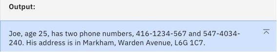
5. Save your work as a prompt session with the name:
   ```
   flan model prompt
   ```

## Task 2b: Generate a response in JSON format

Follow these steps generate a simple JSON file, and add a stop sequence:

1. Switch to the **granite-3-8b-instruct** model, and click **Generate**. The results is valid JSON. The *granite-3-8b-instruct* model demonstrates that it understands how to translate input text to JSON.<br/>
   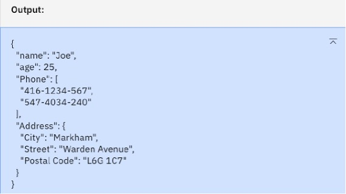
1. Save your work as a prompt session with the name:
   ```
   granite model prompt
   ```

[Back to the top](#top)

## Task 2c: Specify stopping criteria

Follow these steps select a different model to generate a simple JSON file, and add a stop sequence:

1. Select the **mistral-small-3-1-24b-instruct-2503** model to test a different foundation model.
2. Click **Generate**. You get the following output.<br/>
   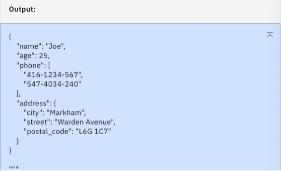  
   The *mistral-small-3-1-24b-instruct-2503* model also generates a valid JSON output, except that it has additional characters at the bottom. While this is not a big issue, you can use the *Stop sequences* parameter to eliminate the extra characters. In this case, you want to stop the generation once the model encounters the following text sequence (2 curly brackets that conclude the JSON section). `} }`
10. Click the **Model parameters** icon .
11. Type the following keystrokes in the *Stop sequences* field: `} press the return or enter key }`<br/>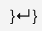<br/>
    If your output looks different, then adjust the stopping sequence to match your output. For example, if the output shows a blank line between the two curly brackets, then press the return or enter key twice.<br/>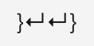
1. Click the **+** icon to add the sequence. The following image shows the **Stop sequences** field:<br/>
   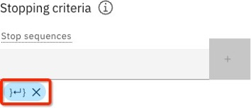
1. Click **Generate**. The following image shows the output which no longer includes the extra characters as the model recognizes the stop sequence and ceases to generate anything after that sequence.<br/>
   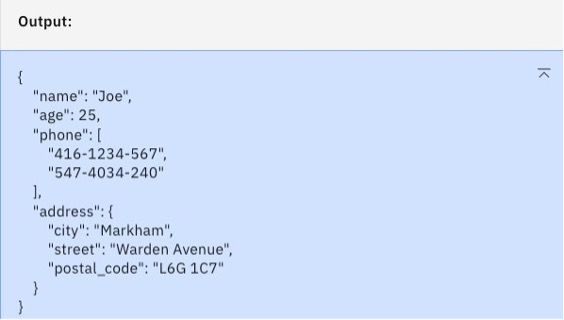
1. Save your work as a prompt session with the name:
   ```
   Stop criteria prompt
   ```

[Back to the top](#top)

### Explore further

- Remove the stop sequence by clicking **X**. What if you specify just one curly right bracket instead? Does this criteria behave as expected?
- Remove the previous stop sequence. What if you specify 2 curly right brackets (with no carriage return in between), using this stop sequence: `}}`. Does this criteria behave as expected?

[Back to the top](#top)

<a name="task03"></a>

# Part 3: Work with prompts in a Jupyter notebook

You have been working with prompt engineering via the console. However, data and AI engineers work programmatically. In this task, you will create a Jupyter notebook for a prompt, and work with prompts in a Jupyter notebook in watsonx.ai.

## Task 3a: Create an API key

To run a Jupyter notebook you will need your API key. If do not have an API key, follow these steps to create an API key:

1. From the watsonx home screen, in the _Developer access_ section, click **Create API key**.
2. Provide a name and description, and click **Create**.
3. When the API key is successfully created, click **Copy**. You won’t be able to see this API key again, so click **Download** to save the API to a JSON file.

Now that you have the key, you are ready to work with the Jupyter notebook. For more information, see [Managing user API keys](https://cloud.ibm.com/docs/account?topic=account-userapikey&interface=ui).

[Back to the top](#top)

## Task 3b: Save a prompt as a Jupyter notebook

As seen previously, you can save your work in three formats: a prompt template, a prompt session, and a standard notebook. Follow these steps to save your work as a Jupyter notebook.

1. From the watsonx home screen, verify that your sandbox project is selected as highlighted in the following image:<br/>
   
2. Click **Open Prompt Lab**.
3. Click the **Saved prompts** icon , and open the **flan model prompt**.
4. Click the **History** icon  to open the history of this prompt session.
5. If the most recent version is not select, select the **Now** version.
6. Click **Save work > Save as**.
7. Select **Standard notebook**.
8. For the name, type:
   ```
   Flan_ul2_notebook
   ```
9. For the description, type:
   ```
   Jupyter notebook - Flan ul2 prompt
   ```
10. Select the **View in project after saving** option.
11. Click **Save**. The Jupyter notebook opens in your project.<br/>
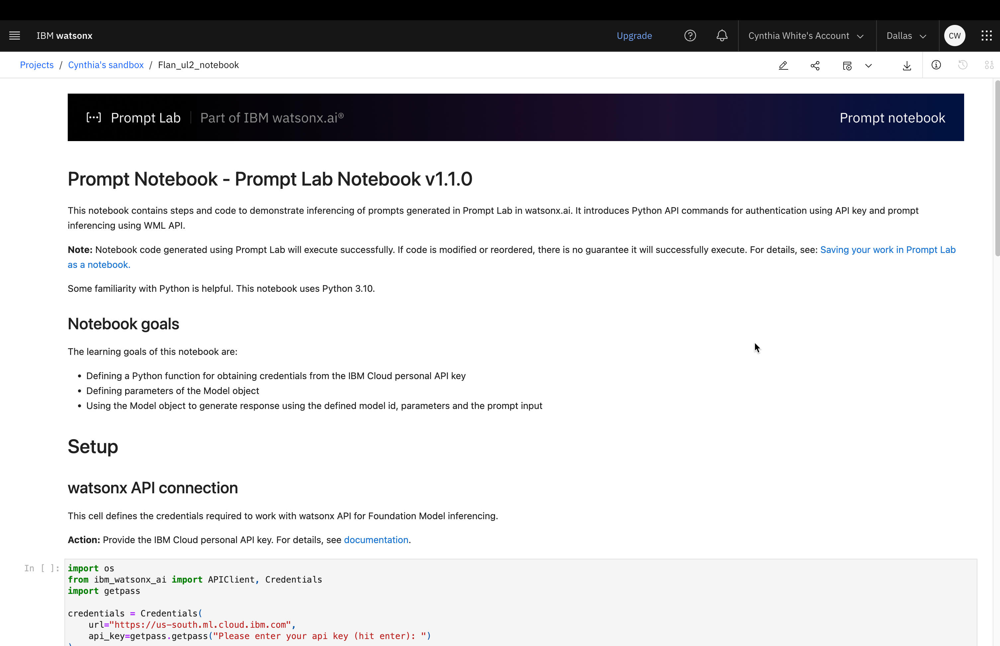

[Back to the top](#top)

## Task 3c: Edit and run the notebook

The Prompt Lab generated a notebook for you. Follow these steps to tweak and run the code in the notebook:

1. Click the **Edit** icon  to open the notebook in edit mode.
1. Select the first cell in the _Setup_ section. This first cell defines the credentials required to work with watsonx API for Foundation Model inferencing.
1. Click the **Run** icon .
1. When prompted, paste your API key, and press **Enter**.<br/>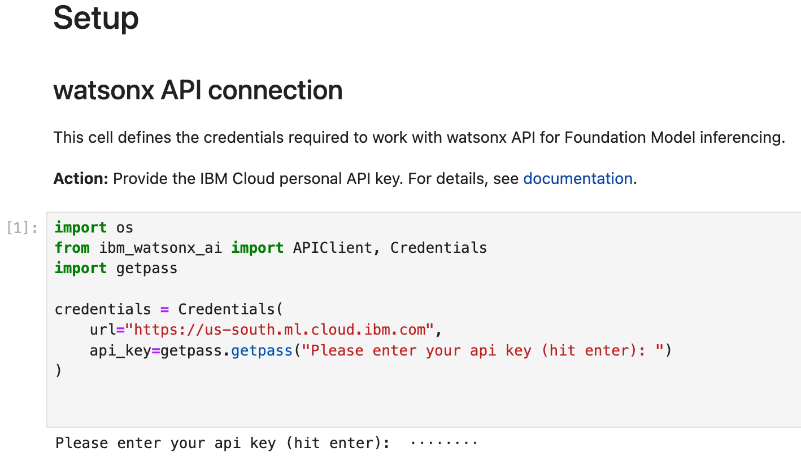
1. Run the cell in the _Defining the model id_ section which specifies the model that you are using. See [Supported foundation models in watsonx.ai](https://dataplatform.cloud.ibm.com/docs/content/wsj/analyze-data/fm-models.html?context=wx) for a complete list of supported foundation models.
1. Run the cell in the _Defining the model parameters_ section which sets the model parameters what will influence the result. You set these parameters in the Prompt Lab before saving your work as a Jupyter notebook. You can change these parameters to experiment and see how they can affect the output. For example, try changing the values of *max_new_tokens* in combination with different values of *repetition_penalty*; and changing values of *top_p* and *top_k*.<br/>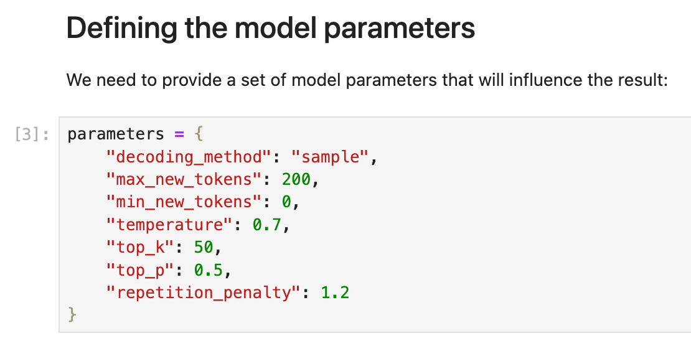
1. Run the cell in the _Defining the project id or space id_ section which uses the project id or space id where the notebook runs.
1. Run the cell in the _Defining the Model object_ section which defines the model object using the defined properties.
1. Run the cell in the _Defining the inferencing input_ section which includes your prompt input that you specified in the Prompt Lab. You can change this input text to experiment with different results.
   - From the model’s point of view, everything between the pair of triple double quotes (“””) is the prompt.
   - This is a one-shot prompt You can use this notebook to quickly test out a few-shot example – simply insert another sample section in the cell.
   - The words Input and Output are not fixed; you can change them. For example, you could change **Output** to **Summarize** or **Conclusion**.
1. Run the cell in the _Execution_ section which pairs the defined model object with the input to generate the response.<br/>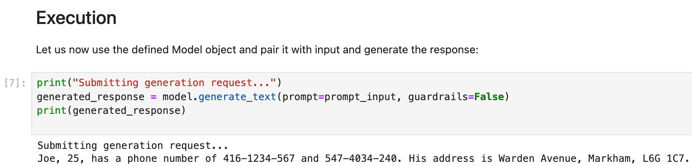

[Back to the top](#top)

# Summary
In this lab, you learned how to complete the following tasks:
- Contrast the different Prompt Lab modes.
- Compare the strengths and weaknesses of different models.
- Test different configuration parameters to how they influence a model in generating output.
- Differentiate zero-shot prompting, one-shot prompting, and few-shot prompting.
- Generate list and JSON files with foundation models.
- Save prompts and prompt sessions.
- Restore a saved prompt to an earlier state via prompt history.
- Save prompts to a Jupyter notebook and working with the Jupyter notebook.

[Back to the top](#top)

# Next steps
Return to the course to complete the module and assessment.
