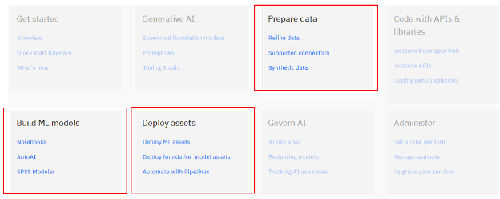
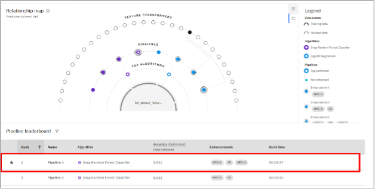
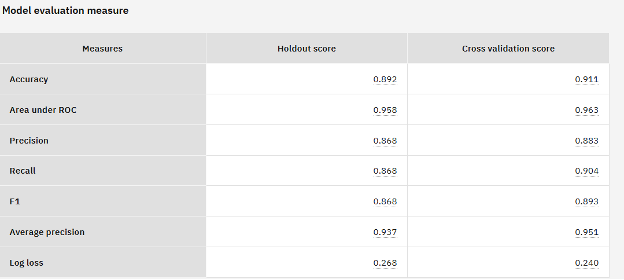
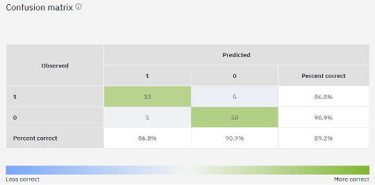
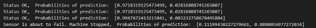

# Overview

# Learning objectives

This lage introduces you to the machine learning and data science capabilities of IBM watsonx. The goal of this lab is to familiarize you with the capabilities of watsonx through practical examples and deepen your understanding of the possiblities that the platform provides.

In this lab, you will complete the following tasks:

- Sign up for an IBM watsonx trial account.
- Set up a project to perform machine learning and data science tasks.
- Run a Python notebook to process data.
- Optional: Build a Data Refinery flow to prepare data.
- Build a binary classification model with AutoAI.
- Save, promote, deploy, and test a machine learning model.
- Build a multivariate time series forecasting model with Python code in a notebook.
- Optional: Build a machine learning model with SPSS Modeler.


Tasks marked as **Optional** provide less guidance and are designed to encourage broader exploration of what you can achieve with watsonx.

## What is machine learning?

Machine learning (ML) is a branch of artificial intelligence (AI) focused on enabling computers and machines to imitate the way that humans learn, to perform tasks autonomously, and to improve their performance and accuracy through experience and exposure to more data.

## What is data science?

Data science combines math and statistics, specialized programming, advanced analytics, artificial intelligence (AI) and machine learning with specific subject matter expertise to uncover actionable insights hidden in an organization’s data. These insights can be used to guide decision making and strategic planning.

## What is forecasting?

Forecasting is a method of predicting a future event or condition by analyzing patterns and uncovering trends in previous and current data. It employs mathematical approaches and applies statistical models to generate predictions.

Machine learning (ML) and AI are used to more accurately build forecasts as they reduce errors by up to 50%.

The most typical forecasting steps include:

- Define what to predict
- Gather data
- Select a forecasting method
- Generate a forecast
- Verify the forecast's accuracy
- Visualize the forecast

<a name="top"></a>

# Contents

- [Task 1: Sign up for the watsonx trial](#task01)
- [Task 2: Work in a project](#task02)
- [Task 3: Process and analyze data](#task03)
- [Task 4: Build a binary classification model](#task04)
- [Task 5: Build a multivariate time series forecasting model with Granite](#task05)
- [Task 6: Optional: Build a model with SPSS Modeler](#task06)

<a name="task01"></a>

# Task 1: Sign up for the watsonx trial

You can use the tools in watsonx to perform many machine learning and data science tasks. Follow these steps to sign up for the watsonx trial:

1. Navigate to <a href="https://dataplatform.cloud.ibm.com/registration/stepone?context=wx" target="_blank">Try IBM watsonx.ai for free</a>.
2. Click **Create account or log in**.
3. Since you are already logged in, click **Continue to console**.
1. Wait while the services are provisioned, then close the *Welcome to watsonx* and *Dive deeper* screens.

[Back to the top](#top)

<a name="task02"></a>

# Task 2: Work in a project

When you signed up for the watsonx trial, a sandbox project is created for your. In your project, you can import and manage various types of assets, add collaborators, define jobs, and monitor the resource usage.

## Task 2a: Associate a service with your project

Follow these steps to open your sandbox project, and associate your machine learning service with the project:

1. From the watsonx home screen, scroll to the *Projects* section.
2. Select your sandbox project.
3. Click the **Manage** tab.
4. Select the **Services & integrations** page.
5. Click **Associate service**.
   1. Select your **watsonx.ai Runtime** service.
   1. Click **Associate**.

## Task 2b: Create an access token

Follow these steps to create an access token to use in the notebook:

1. Click the **Access control** tab.
2. Click **New access token**.
3. For the *Name*, type: ```notebook access token```.
4. For the *Access role*, select **Editor**.
5. Click **Create**.

## Task 2c: Import your Data

Next, you can import data by connecting to an existing data source, or by uploading data directly to the project. You can find all of your project data on the **Assets** tab. Follow these steps to upload data to your project:

1. Click the **Assets** tab.
2. Download the [iot_sensor_dataset](https://github.com/academic-initiative/skillsbuild/blob/main/watsonx/files/iot_sensor_dataset.csv).
3. Click **Import assets > Local file > Data asset**.
4. Click **Browse**, navigate to the local **iot_sensor_data.csv** file, and click **Open**.
5. Click **Done** to see the data set on the _Assets_ tab.
6. Click the data set to get a preview.  
    Sensors mounted on devices like IoT devices, Automated manufacturing like Robot arms, Process monitoring and Control equipment etc., collect and transmit data on a continuous basis which is time stamped. The data set contains IoT Sensor data that you can use to predict equipment failure.

## Further Documentation

For more information, see the following documentation topics:

- [Administering a project](https://ibm.biz/BdGKhW)
- [Asset types](https://ibm.biz/BdGKVR)

# Exploring the machine learning and data science capabilities of watsonx

Watsonx offers more than just generative AI capabilities. In this lab, you will learn how to **prepare** and **analyze data**, build **machine learning models**, and **deploy** your solutions – all while using the watsonx platform. The relevant sections of the documentation are highlighted in the picture below.<br/>

Watsonx provides a set of three tools to build ML models and performing essential data science tasks:

- Notebooks for programming in Python or R
- AutoAI
- SPSS Modeler

To explore more about these tools and the other functionalities relevant to this lab, you can go to the [watsonx documentation](https://dataplatform.cloud.ibm.com/docs/content/wsj/getting-started/welcome-main.html?context=wx&audience=wdp) and read about what you can achieve by using them. However, this lab will provide a practical example for each of these tools. Additionally, many links throughout the lab will direct you to specific sections of the documentation for further details

**Note**: A **common mistake** when going through these tutorials is to skip the provided videos. These short videos give a clearer understanding of the entire process and help you navigate much more efficiently. For instance, the visual guide to generate an API key and identify the location (e.g. location = “us-south” for Dallas) is much more intuitive when first watching the video before reading through the tutorial.

[Back to the top](#top)

<a name="task03"></a>

# Task 3: Process and analyze data

Watsonx provides multiple methods for preprocessing data to ensure its suitability for machine learning. Depending on the use case, data transformation may be required before applying machine learning algorithms. Performing exploratory data analysis beforehand is generally recommended to better understand the dataset and its characteristics.

**Note**: If you have issues obtaining the example notebook or the final datasets for this task, the IBM team can provide them.

## Task 3a: Run a Python notebook in your project

Using a notebook with custom code provides maximum flexibility for data analysis and transformation. Notebooks can also be scheduled to run automatically, for example, when a new data asset is added to a project space, ensuring it is transformed into the specified format.

Follow these steps to import the example notebook, and run the cells in the notebook:

1. From the _Assets_ tab, click **New asset**.
2. In the list of assets that you can create, select **Work with data and models in Python or R notebooks**.
3. In this case, import a notebook from a **URL**.
4. In the _Name_ field, type:
   ```
   Data preparation
   ```

1. In the _Notebook URL_ field, paste the following link:

   ```
   https://raw.githubusercontent.com/academic-initiative/skillsbuild/refs/heads/main/watsonx/files/data-preparation.ipynb
   ```

1. Click **Create**, and then wait for the notebook to load.
2. Select the first cell in the notebook, and click the Run icon  to import the libraries.
3. Run the code in the second cell to read the data set from the GitHub repository, and see the first 10 rows of the data set.
4. Run the cell in the _Are there missing values?_ section to see any rows with missing values.
5. Run the two cells in the _How balanced is the data set?_ section. The data set is considered to have a mild imbalance because there are fewer rows where the sensor failed (fail=0) than rows where the sensor didn’t fail (fail=1).
6. Run the two cells in the _Is the data categorical or numerical?_ section. The first cell in this section counts the number of distinct, non-null elements in each column or row of a data frame.
7. Run the cells in the _Analyze the correlation between the predictor and target variable_ section, and review the results:
    1. Separate the categorical and numerical variables as well as the target.
    2. Encode the categorical variables by converting them to category codes.
    3. Calculate the dependency between the target and the categorical variables.
    4. Calculate the dependencies between the target and the numerical variables.
    5. Print the dependencies for the numerical variables.
    6. Print the dependencies for the categorical variables.
8. Run the cell in the _Extract a subset of the data_ section. You will use the resulting small data set for testing the deployed model.
9. In the _Save the data to your project space_ section, follow these steps:
    1. Click **More icon**  **> Insert project token**.
    2. Run the cell to set the variables containing your project ID and token.
    3. Run the cell to _Save the training data set_ file.
    4. Run the cell to _Save the test data set_ file.
10. Click the sandbox project name to return to the project’s _Assets_ tab to see the two data sets:

- iot_sensor_data_training.csv
- iot_sensor_data_test.csv

## Task 3b: Optional: Build a Data Refinery flow

You can build a data refinery flow by using a graphical user interface. Follow these steps to open the data set in Data Refinery.

1. From the project’s _Assets_ tab, click the **iot_sensor_data_training.csv** data set to preview the data.
2. Click **Prepare data** to open the data set in Data Refinery.

### How balanced is the data set?

1. Click the **Profile** tab.
2. Scroll to the **fail** column.
3. Hover over **0** and **1** bars to see the frequency of each. The data set is considered to have a mild imbalance because there are fewer rows where the sensor failed (fail=0) than rows where the sensor didn’t fail (fail=1).

Refer to the [Refining data](https://ibm.biz/BdGGxg) documentation topic to learn how to prepare the data set in the following ways using Data Refinery:

- Separate the categorical and numerical variables as well as the target.
- Encode the categorical variables by converting them to category codes.
- Calculate the dependency between the target and the categorical variables.
- Calculate the dependencies between the target and the numerical variables.
- Show the dependencies for the numerical variables.
- Show the dependencies for the categorical variables.

[Back to the top](#top)

<a name="task04"></a>

# Task 4: Build a binary classification model

In this example, you use the iot_sensor_dataset.csv, iot_sensor_dataset_test.csv and some Python code. The data set includes sensor readings and a column indicating whether a sensor has failed (0 or 1). Since the target (fail) column involves distinguishing between two possible outcomes, the data is well-suited for a binary classification model.

## Task 4a: Create a new AutoAI experiment

1. In your project’s _Assets_ tab, click **New asset > Build machine learning or RAG solutions automatically.**
2. In this case, select **Build a machine learning model**, and click **Next**.
3. For the _Name_, type the following text, and click **Create**.
   ```
   Sensor experiment
   ```

## Task 4b: Configure the experiment

1. Click **Select from project**.
    - Select **Data asset > iot_sensor_data_training.csv**.
    - Click **Select asset**.
2. Select **No** for the _Create a time series analysis?_ question.
3. For the _Prediction_ column, select **fail**. Since you want to predict if the sensor will fail, the _fail_ column serves as the target variable, while the remaining columns will act as features.

As expected, AutoAI chose **Binary Classification** for the _Prediction Type_. However, before running the experiment, you can view all of the settings for the AutoAI experiment.

1. Click **Experiment settings**. In the _Experiment Settings_ page, you can customize the experiment.

   The **Prediction** settings allow customization of the prediction type (keep binary classification unchanged), selection of the positive class, choice of the optimization metric, and specification of algorithms for the experiment. The positive class should be set to 1, indicating that a '1' in the dataset represents a sensor failure.

   The **Data source** settings allow configuration of key aspects, including dataset properties, feature selection, and the splitting strategy for training, testing, and validation

   The **Runtime** settings show you additional details about your experiment, but you cannot change these here.

   | Settings Category | Description |
   |-------------------|-------------|
   | Prediction settings | Allows customization of prediction type, selection of positive class, choice of optimization metric, and specification of algorithms for the experiment. The positive class should be set to 1, indicating that a '1' in the dataset represents a sensor failure. |
   | Data source settings | Configures key aspects, including dataset properties, feature selection, and the splitting strategy for training, testing, and validation. |
   | Runtime settings | Displays additional details about your experiment, but these settings cannot be changed here. |

1. You do not need to change anything, but take some time to review the _Prediction_, _Data source_, and _Runtime_ panels. In particular, review the following settings, and then click **Cancel** when you are done.

   - Optimized metric
   - Algorithms to include
   - Algorithms to use
   - All settings on the _Data source_ panel > _General_ tab

   A detailed documentation for the experiment settings is provided here: [Configure experiment settings](https://ibm.biz/BdGaXi)

1. Click **Run experiment**, and wait while the _Progress map_ and _Pipeline leaderboard_ are filled in.

## Task 4c: Analyze the experiment results

AutoAI will automatically build different pipelines and compare them to each other based on the metrics specified in the experiment settings. In this example, the pipelines will be optimized and ranked for accuracy & run time.

You will see the top performing pipeline in the leaderboard. The table will show you the algorithm used, the accuracy, the enhancements ([hyperparameter optimization](https://ibm.biz/BdGaXG) and [feature engineering](https://ibm.biz/BdGaXK)) as well as the build time for each pipeline candidate.

<br/>

1. When the experiment completes, click the **Pipeline comparison**. This chart compares the 8 pipelines based on different metrics.
2. Click the **Rank preferences** icon  to change the _Metric_ and _Score type_ to update the metric chart and the leaderboard.
3. Select the top performing pipeline to see the detailed results.
4. Click the **Model information** page. This page displays basic information.
5. Click the **Feature summary** page. AutoAI chooses only the most important features. Here you see the importance score of each selected feature.
6. Select the **Model evaluation** page. This page shows you the quality measures and associated scores. The holdout score is the score obtained from evaluating the trained model on a separate holdout of the data that was not used for the training of the model. The cross-validation score is the average result from multiple training and validation splits. In a balanced dataset, where the data is independent and identically distributed, cross-validation is generally more reliable as it reduces variance by averaging results across multiple splits.<br/>

   The following table provides a quick explanation of the evaluation measures.

   | **Measure** | **Description** | **Note** |
   | --- | --- | --- |
   | Accuracy | Measures how many observations (0 or 1) are correctly classified. | If the dataset is unbalanced, accuracy might not be the best measure since it might be high by simply always predicting 0 or 1. |
   | Area under ROC | Indicates how well the model identifies differences between classes. | Higher scores indicate better model performance with identifying classes |
   | Precision | When the model predicts a sensor failure, how often is it really a sensor failure? | High precision means not many false positives. |
   | Recall | Out of all sensor failures, how many did the model predict? | High recall means not many false negatives. |
   | F1  | The F1 score can be interpreted as a weighted average of the precision and recall values, where an F1 score reaches its best value at 1 and worst value at 0. | &nbsp;A low F1 score is an indication of both poor precision and poor recall. |
   | Average Precision (AP Score) | The AP is the area under the plotted curve of precision against recall. | The higher the AP score the better the model performance. |
   | Log Loss | Indicates how close the prediction probability is to the true value (0 or 1). | The higher the log loss, the worse is the performance of the model. |

1. Click the **Confusion matrix page**. This page displays a matrix showing the predicted values against the actual values from the dataset is shown.<br/>

## Task 4d: Save the model

You are now ready to save and deploy the top performing pipeline to make the model available for predictions on new data. Follow these steps to save the model:

1. For the best performing model, click **Save as**.
2. Select the **Model** asset type.
3. Accept the default name.
4. Click **Create**. The model is saved to the _Assets_ tab in the project.

## Task 4e: Promote the test data to the deployment space

1. Click the project name to return to the _Assets_ tab.
2. Locate the _iot_sensor_data_test.csv_ data set.
3. Click the **Overflow** menu, and choose **Promote to space**.
4. For the _Target space_, either select an existing space, or follow these steps to create a new space:
    1. Select **Create a new deployment space**.
    2. Provide a name for the new space.
    3. For the _Deployment stage_, select **Testing**.
    4. For the _Watson Machine learning_, select your **watsonx.ai Runtime** service.
    5. Click **Create**. The new deployment space is selected for the target space.
5. Click **Promote**.

## Task 4f: Promote the model to a deployment space

1. Back on the _Assets_ tab, open the model.
2. Review the AI factsheet containing the relevant data about the model.
3. Click the **Promote to space** icon .
4. For the _Target space_, select the same deployment space where the data set is promoted.
5. Select the **Go to the model space after promoting it** option.
6. Click **Promote**.

## Task 4g: Deploy and test the model

Now that the model is promoted to a deployment space, follow these steps to create a model deployment and test the model:

1. Click **New deployment**.
2. For the _Deployment type_, select **Online**.
3. Type a name for the deployment.
4. Click **Create**, and wait for the model to be deployed.
5. When the _Status_ changing to **Deployed**, click the deployment name.
6. On the _API reference_ tab, review the endpoints and code snippets to incorporate this deployed model in your application.
7. Click the **Test** tab.
8. Click **Search in space**.
    1. Select **Data asset > iot_sensor_data_test.csv**.
    2. Click **Confirm**.
9. Click **Predict**.
10. Review the prediction and confidence score for each of the test records.

## Task 4h: Optional: Test the deployment using Python code

You can use a short script to simulate a real-world scenario where an industrial sensor is sending data to the model and if the model classifies the reading as a failure, the machine will be stopped.

1. Create a notebook containing the code in the appendix and the _iot_sensor_data_test.csv_ dataset. Refer to the [Creating and managing notebooks](https://dataplatform.cloud.ibm.com/docs/content/wsj/analyze-data/creating-notebooks.html?context=wx) for details on how to create a blank notebook.
2. Copy the code from the _Appendix_ into the notebook.
3. Verify that you are using the _public endpoint_ to reach the deployment.
4. Obtain an API Key:
    1. From the watsonx home screen, scroll to the _Developer access_ section.
    2. Click ****Create API key****.
    3. Provide a name, such as:
       ```
       watsonx API key
       ```
    4. Click **Create**.
    5. Click **Copy**, and save it to a text file to be used later.
    6. Click **Download** to save the API key in a JSON file for future use.
    7. Copy the _watsonx.ai URL_, and save it to a text file to be used later.<br/>

[Back to the top](#top)

<a name="task05"></a>

# Task 5: Build a multivariate time series forecasting model with Granite

IBM’s open-source Granite Time Series models are pre-trained for multivariate time-series forecasting. The idea of utilizing tiny pre-trained models with 1-3 million parameters for time-series forecasting were first introduced in this series. In this lab, you build a scikit-learn model using a sample notebook.

1. Click **IBM watsonx** in the menu bar to return to the home page.
1. Open your sandbox project.
1. From the _Assets_ tab, click **New asset**.
2. In the list of assets that you can create, select **Work with data and models in Python or R notebooks**.
3. In this case, import a notebook from a **URL**.
4. In the _Name_ field, type:
   ```
   Data preparation
   ```

1. In the _Notebook URL_ field, paste the following link:

   ```
   https://raw.githubusercontent.com/academic-initiative/skillsbuild/refs/heads/main/watsonx/files/autoai-time-series-model.ipynb
   ```

1. Click **Create**, and then wait for the notebook to load.

### Section 1: Set up the environment

1. Run the first cell to install and import the libraries.
2. In the _Connection to WML_ section:
    1. Paste your API key and location URL. Refer to _Task 5h: Optional: Test the deployment using Python code_ for instructions to obtain the API key and watsonx.ai Runtime URL. For example, `https://us-south.ml.cloud.ibm.com`.
    2. Run the three cells to set your credentials.
3. In the _Working with spaces_ section:
    1. Run the cell with the code `client.spaces.list(limit=10)`.
    2. Copy the **ID** for your deployment space
    3. Paste the ID value in the _space_id_ variable in the previous cell.
    4. Run the three cells in this section.

### Section 2: Timeseries data set

1. Run the code in the _Connections to COS_ section to read the credentials from the default deployment space.
2. In the _Training data sets_ section, notice the link to the _PM25.csv_ data set in the Github repository. Run the next three cells to read this data set into a data frame.
3. In the _Visualize the data_ section, run the code in the necxt two cells to create a subset of the data frame and that plot that subset.
4. In the _Create connection_ section, run the code in the two cells in this section to establish the connection to the Cloud Object Storage instance.
5. In the _Training data connection_ section, run the code to define the connection to the asset to use for the training data.

### Section 3: Optimizer definition

In the _Optimizer configuration_ section, run the code to provide the input information for the AutoAI optimizer.

## Section 4: Experiment run

Run the two cells in this section to:

1. Call the `fit()` method to trigger the AutoAI experiment.
2. Monitor the job using `get_run_status()`.

## Section 5: Pipelines comparison

1. Run the code in the first two cells in this section to:
    1. Call the `summary()` method to see information about the trained pipelines and evaluation metrics.
    2. Call the `get_pipeline_details()` method to view the pipeline details for the best pipeline candidate.
2. In the _Holdout data visualization_ section, run the code to see the visualization.
3. In the _Backtest data visualization_ section, run the code to see the visualization.

## Section 6: Deploy and Score

1. In the _Online deployment creation_ section, run the code in the two cells in this section to:
   1. Create an online deployment.
   1. Show the parameters of the online deployment.
4. In the _Scoring_ section, run the code in the cell to get predictions for the next 7 days.
5. In the _Visualization of predictions_ section, run the code in the cell to see the visualization.

[Back to the top](#top)

<a name="task06"></a>

# Task 6: Optional: Build a model with SPSS Modeler

SPSS Modeler provides a no-code solution for building anomaly detection models, allowing you to very quickly identify unusual data points even when the underlying pattern is unknown. This method is unsupervised, meaning it does not require a training dataset with a predefined target variable.

SPSS Modeler’s anomaly detection capability helps identify irregular data points. This can be useful during exploratory data analysis, particularly for data auditing before using the data for modeling. The anomaly detection node clusters similar records and flags those that significantly deviate from the cluster centers. However, it is more of a general-purpose method and may not be the best choice for domain-specific anomaly detection, such as detecting fraudulent transactions in finance or unusual billing patterns in healthcare, where more specialized methods may be needed.

But by using the anomaly node in SPSS Modeler, you can very quickly scan datasets for irregularities, making it a valuable tool for detecting anomalies, especially if you have no prior knowledge of the data. For more information, read the detailed description of the <a href="https://dataplatform.cloud.ibm.com/docs/content/wsd/nodes/anomalydetection.html?context=wx" target="_blank">Anomaly node</a>.

Try these tutorials to learn how to build a model by using SPSS Modeler.
- <a href="https://dataplatform.cloud.ibm.com/docs/content/wsj/getting-started/get-started-build-spss.html?context=wx" target="_blank">Quick start: Build a model with SPSS Modeler</a>: This tutorials helps you learn the basics of working with SPSS Modeler. The data set used in this tutorial is from the University of California, Irvine, and is the result of an extensive study based on hospital admissions over a period of time. The model will use three important factors to help predict chronic kidney disease.

- <a href="https://dataplatform.cloud.ibm.com/docs/content/wsd/tutorials/tut_bandwidth.html?context=wx" target="_blank">Forecast bandwidth utilization</a>: This tutorial provides an example of an analyst for a national broadband provider, who forecasts user subscriptions to predict utilization of bandwidth. They need forecasts for each of the local markets that make up the national subscriber base.

- Other <a href="https://ibm.biz/spss-tutorials-wx" target="_blank">SPSS Modeler tutorials</a>

[Back to the top](#top)

# Summary
In this lab, you learned how to complete the following tasks:

- Sign up for an IBM watsonx trial account.
- Set up a project to perform machine learning and data science tasks.
- Run a Python notebook to process data.
- Optional: Build a Data Refinery flow to prepare data.
- Build a binary classification model with AutoAI.
- Save, promote, deploy, and test a machine learning model.
- Build a multivariate time series forecasting model with Python code in a notebook.
- Optional: Build a machine learning model with SPSS Modeler.

# Appendix

Code for sending requests and making predictions using the model deployed during the **binary classification with AutoAI** example:

```
# Imports

import pandas as pd
import requests
import time

# Read the data from the file iot_sensor_failure_test.csv
# Change the path to the file if needed
df = pd.read_csv('iot_sensor_failure_test.csv')
df.head()

## Get an access token
# NOTE: You must manually set API_KEY below using information retrieved from your IBM Cloud account (https://dataplatform.cloud.ibm.com/docs/content/wsj/analyze-data/ml-authentication.html)
API_KEY = #Your API-Key
token_response = requests.post('<https://iam.cloud.ibm.com/identity/token>', data={"apikey": API_KEY, "grant_type": 'urn:ibm:params:oauth:grant-type:apikey'})
mltoken = token_response.json()\["access_token"\]

# Copy the code snippet from the model deployment page. Make sure to use the public endpoint
# Function to make a prediction on sensor reading
def get_prediction(payload):
    header = {'Content-Type': 'application/json', 'Authorization': 'Bearer ' + mltoken}
    # NOTE: manually define and pass the array(s) of values to be scored in the next line
    payload_scoring = payload
    # Use the public endpoint for the deployed model. Change &lt;public endpoint&gt;.
    response_scoring = requests.post(&lt;public endpoint&gt;, json=payload_scoring,
    headers={'Authorization': 'Bearer ' + mltoken})
    response = response_scoring.json()
    prediction = response\['predictions'\]\[0\]\['values'\]\[0\]\[0\]
    probability = response\['predictions'\]\[0\]\['values'\]\[0\]\[1\] 
    return prediction, probability

# Run predictions. The first three request should (optionally) not predict a failure if you use the dataset generated with the tutorial
sensor_data = df.drop(\['fail'\], axis=1)
input_fields = df.columns\[:-1\].tolist()
for index, row in sensor_data.iterrows():
    input_data = row.tolist()
    payload = {"input_data": \[{"fields": input_fields , "values": \[input_data\]}\]}
    prediction = get_prediction(payload)
    if prediction\[0\] == 1:
       print("Sensor is about to fail. Machine stopped, ", "Probabilities of prediction: ", prediction\[1\])
       break
    else:
       print("Status OK, ", "Probabilities of prediction: ", prediction\[1\])
       time.sleep(2)
```